# System Architecture

This page provides a comprehensive overview of Crudibase's system architecture, including deployment, component layers, and data flow.

## Table of Contents
- [System Overview](#system-overview)
- [Deployment Architecture](#deployment-architecture)
- [Application Layers](#application-layers)
- [Component Interactions](#component-interactions)
- [Technology Stack](#technology-stack)
- [Security Architecture](#security-architecture)

## System Overview

Crudibase is a full-stack TypeScript application organized as a monorepo with npm workspaces:

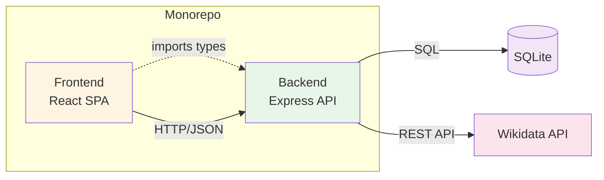

**Key Characteristics:**
- **Monorepo structure** with shared TypeScript types
- **Strict separation** between frontend and backend
- **RESTful API** for all communication
- **SQLite database** for user data and caching
- **External API integration** with Wikidata

## Deployment Architecture

### Production Setup

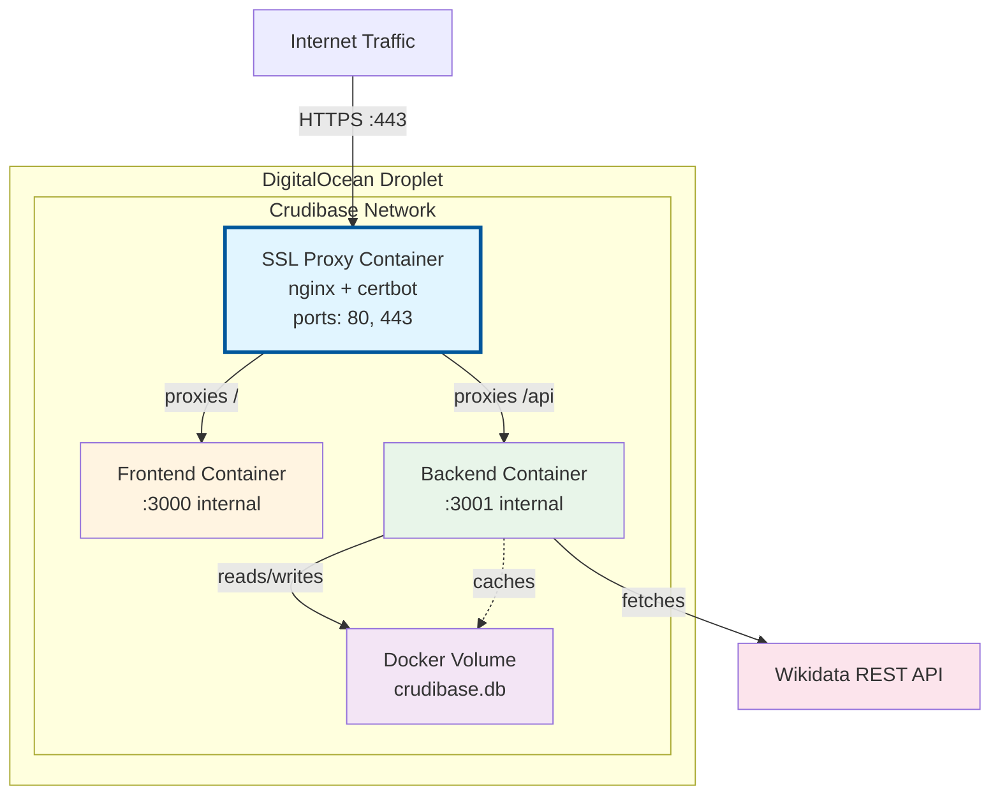

**Key Points:**
- **SSL Proxy** runs from separate repository ([ssl-proxy-for-do](https://github.com/softwarewrighter/ssl-proxy-for-do))
- **No external ports** exposed by application containers
- **Internal Docker network** for communication
- **SSL termination** handled by nginx with Let's Encrypt
- **Database persistence** via Docker volume

### Development Setup

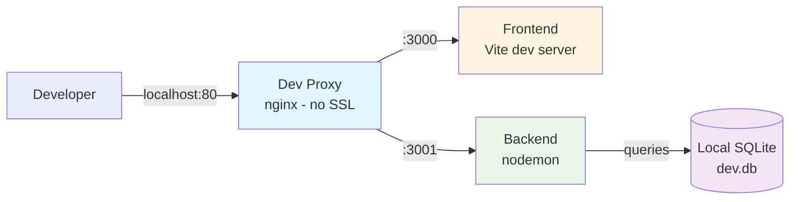

**Development Features:**
- Optional **dev proxy** for testing production-like routing
- **Hot reload** on both frontend and backend
- **In-memory database** option for testing
- **Direct port access** (3000, 3001) without proxy

## Application Layers

### Frontend Layer (React SPA)

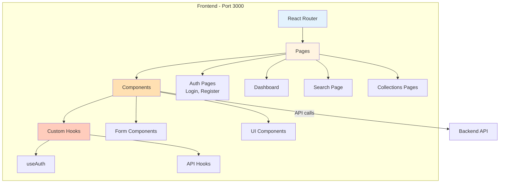

**Organization:**
- `src/frontend/src/App.tsx` - Root component with routing
- `src/frontend/src/pages/` - Page-level components
- `src/frontend/src/components/` - Reusable UI components
- `src/frontend/src/hooks/` - Custom React hooks (planned)
- `src/frontend/src/test/` - Test utilities

### Backend Layer (Express API)

```mermaid
graph TB
    subgraph "Backend - Port 3001"
        Entry[Express App<br/>index.ts] --> Middleware

        Middleware[Middleware Layer] --> Auth[JWT Auth]
        Middleware --> Validation[Zod Validation]
        Middleware --> ErrorHandler[Error Handler]

        Middleware --> Routes[Route Layer]

        Routes --> AuthRoutes[/api/auth/*]
        Routes --> UserRoutes[/api/user/*]
        Routes --> WikiRoutes[/api/wikibase/*]
        Routes --> CollRoutes[/api/collections/*]

        Routes --> Services[Service Layer]

        Services --> AuthService[AuthService]
        Services --> WikiService[WikibaseService]

        Services --> Models[Model Layer]

        Models --> User[User Model]
        Models --> Collection[Collection Model]

        Models --> DB[(SQLite Database)]
    end

    Services -.->|caching| DB
    Services -->|external API| Wikidata[Wikidata]

    style Entry fill:#e8f5e9
    style Middleware fill:#c8e6c9
    style Routes fill:#a5d6a7
    style Services fill:#81c784
    style Models fill:#66bb6a
    style DB fill:#f3e5f5
```

**Organization:**
- `src/backend/src/index.ts` - Express app setup
- `src/backend/src/routes/` - HTTP route handlers
- `src/backend/src/services/` - Business logic
- `src/backend/src/models/` - Data access layer
- `src/backend/src/utils/` - Utilities (DB, JWT, validation)

### Service Layer Pattern

The backend uses a **Service Layer Pattern** to separate concerns:

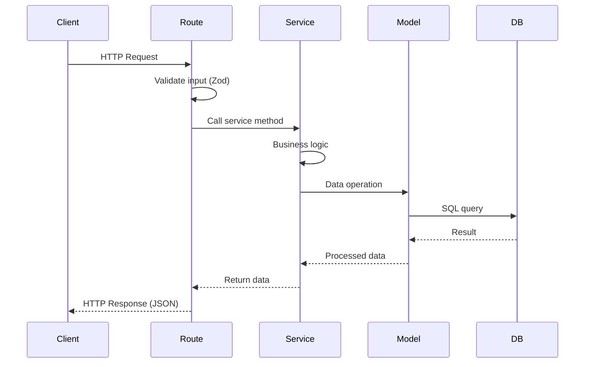

**Benefits:**
- **Routes** handle HTTP only (validation, response formatting)
- **Services** contain business logic (reusable, testable)
- **Models** handle data access (SQL abstraction)
- Easy to test each layer independently

## Component Interactions

### Request Flow

```mermaid
graph LR
    User[User Action] -->|1. Click/Submit| Frontend

    subgraph "Frontend"
        Frontend[Component] -->|2. Validate| Form
        Form -->|3. API call| Axios[Axios/Fetch]
    end

    Axios -->|4. HTTP + JWT| Backend

    subgraph "Backend"
        Backend[Route Handler] -->|5. Auth check| JWT[JWT Middleware]
        JWT -->|6. Validate| Zod[Zod Schema]
        Zod -->|7. Execute| Service[Service Layer]
        Service -->|8. Query| Model[Model Layer]
    end

    Model -->|9. SQL| DB[(Database)]
    DB -->|10. Result| Model
    Model -->|11. Data| Service
    Service -->|12. Format| Backend
    Backend -->|13. JSON| Frontend
    Frontend -->|14. Update UI| User

    style Frontend fill:#fff4e1
    style Backend fill:#e8f5e9
    style Service fill:#81c784
    style DB fill:#f3e5f5
```

### Data Flow Patterns

**Pattern 1: Authenticated API Request**
```
Frontend → JWT in header → Backend verifies → Service executes → Model queries DB → Response
```

**Pattern 2: Wikibase Search with Caching**
```
Frontend → Backend → Check cache → [Cache miss] → Fetch from Wikidata → Store in cache → Response
```

**Pattern 3: Collection Operations**
```
Frontend → Backend → Verify ownership → Update DB → Invalidate cache if needed → Response
```

## Technology Stack

### Frontend Technologies

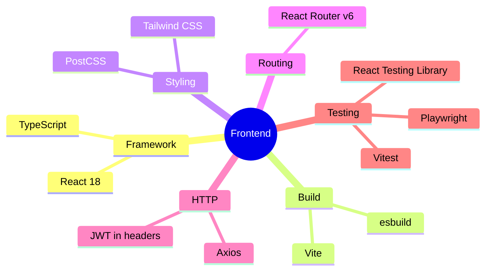

### Backend Technologies

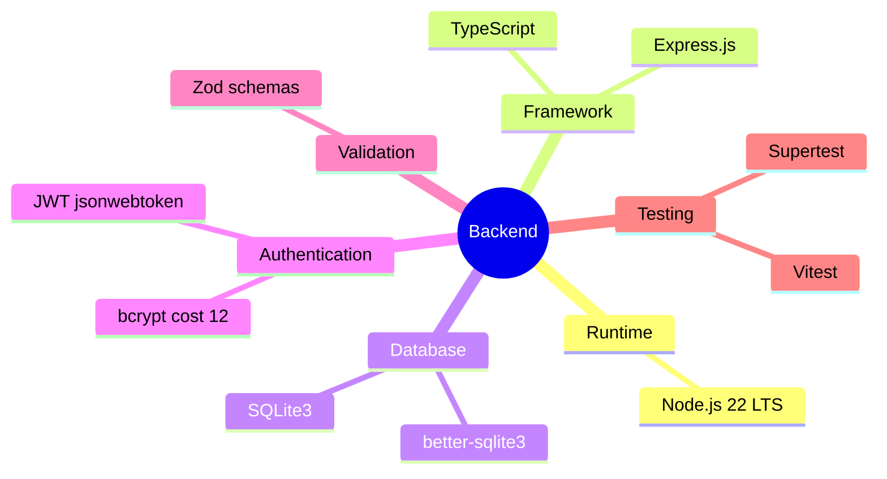

## Security Architecture

### Authentication Flow

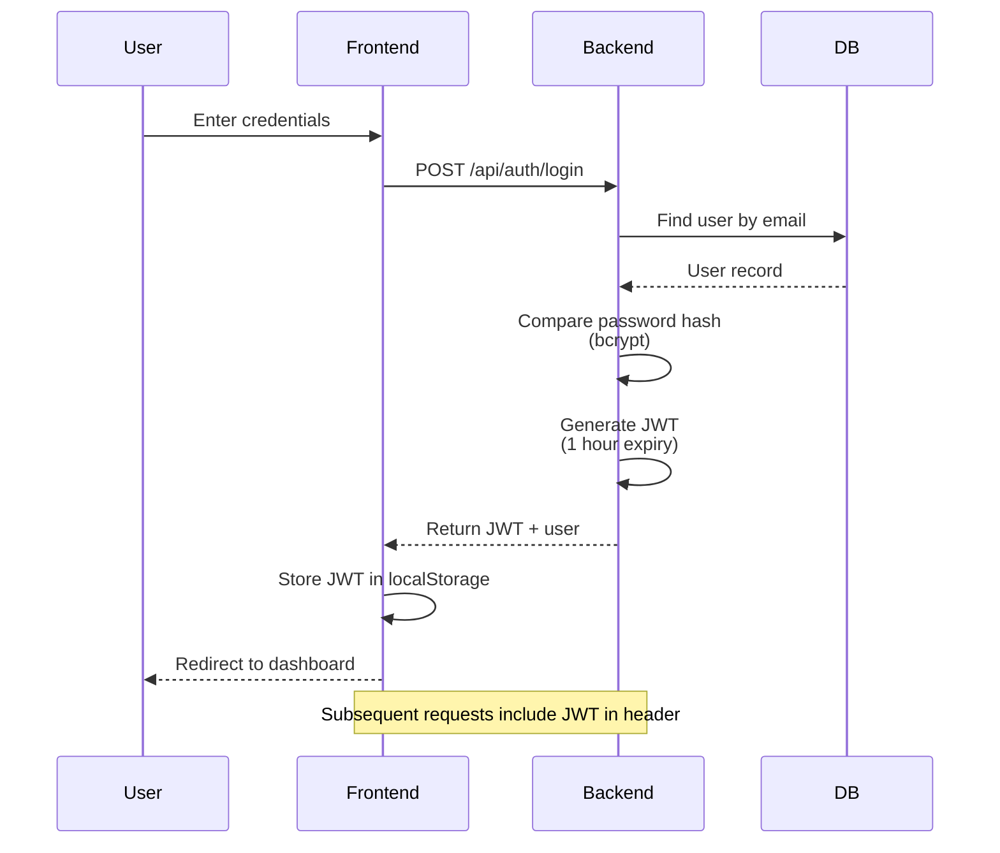

### Security Layers

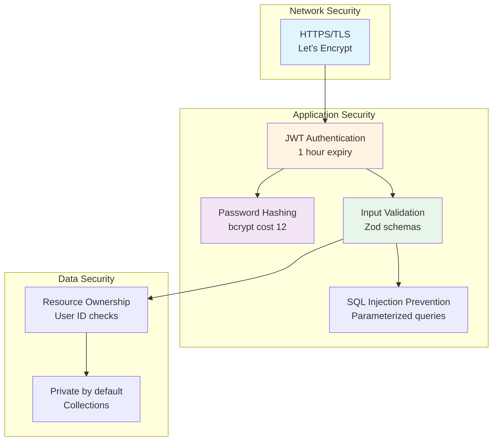

**Security Measures:**
1. **Transport**: HTTPS with Let's Encrypt certificates
2. **Authentication**: JWT with 1-hour expiration
3. **Passwords**: bcrypt hashing with cost factor 12
4. **Input Validation**: Zod schemas on all inputs
5. **SQL Injection**: Parameterized queries (better-sqlite3)
6. **XSS Protection**: React's built-in escaping
7. **CSRF**: SameSite cookies (planned)
8. **Authorization**: User ID verification on all operations

## Performance Considerations

### Caching Strategy

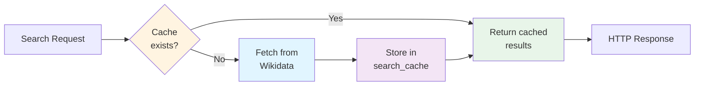

**Cache Implementation:**
- **Location**: SQLite `search_cache` table
- **Key**: SHA-256 hash of query
- **TTL**: Configurable expiration
- **Invalidation**: Automatic on expiry

### Database Optimization

- **SQLite in WAL mode** for better concurrency
- **Indexes** on frequently queried fields
- **Connection pooling** in application layer
- **Prepared statements** for query performance

## Scalability Path

### Current (MVP - SQLite)
```
Single server → SQLite file → Handles 100s of users
```

### Future (If needed)
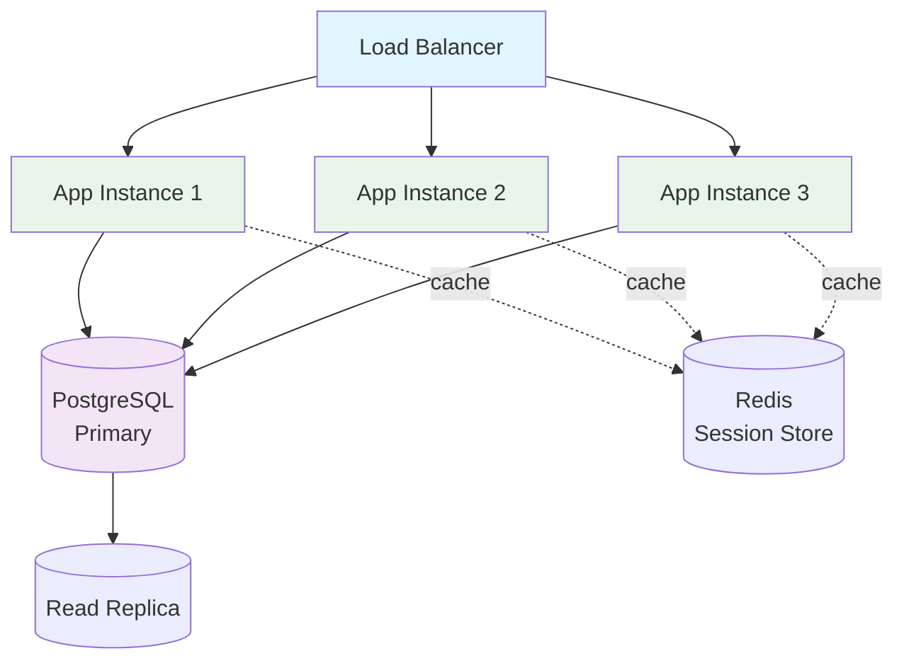

**Migration Path:**
1. Keep SQLite for MVP (sufficient for 100s of users)
2. If needed: Migrate to PostgreSQL for multi-instance support
3. Add Redis for session storage and caching
4. Implement horizontal scaling with load balancer

## Related Pages

- [[Deployment-Architecture]] - Detailed deployment setup
- [[Database-Schema]] - Database design and models
- [[Authentication-Flow]] - Detailed auth sequences
- [[API-Reference]] - API endpoint documentation

---

**Last Updated**: 2025-11-17
