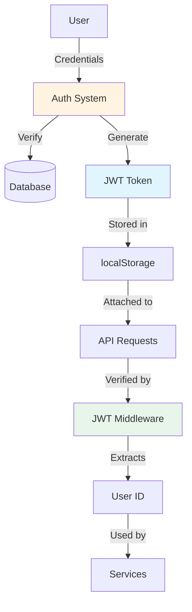
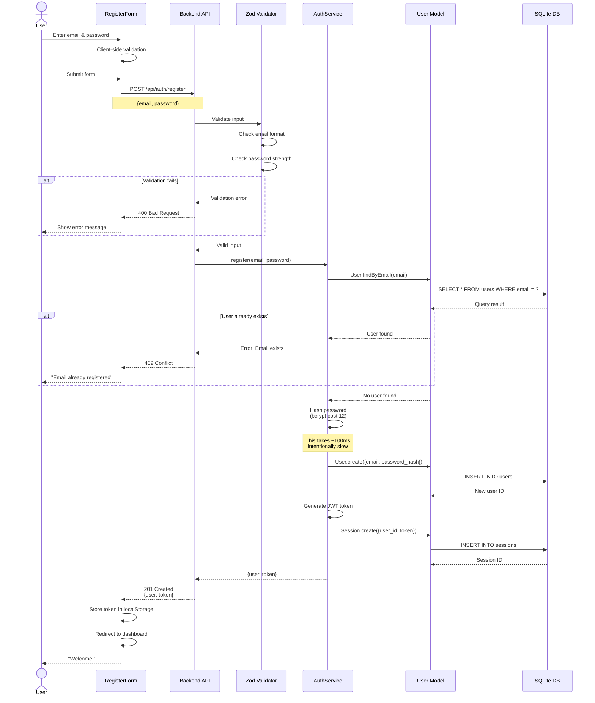
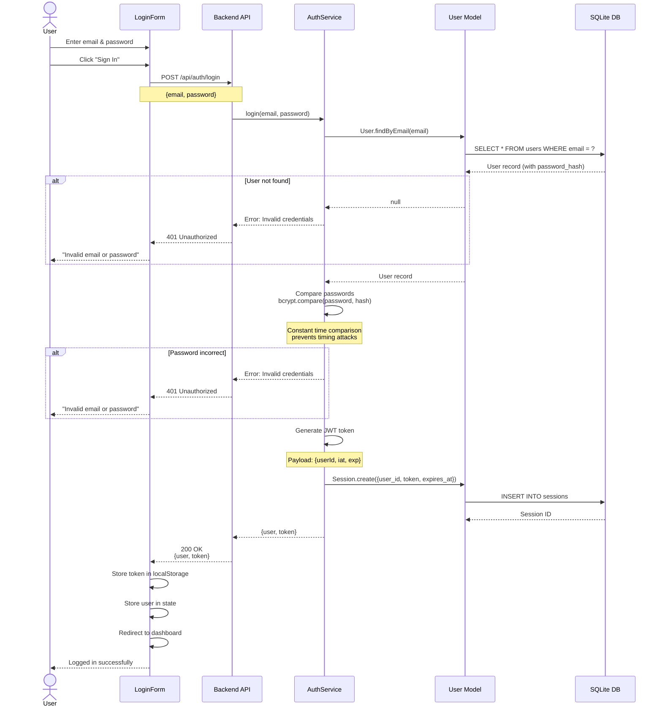
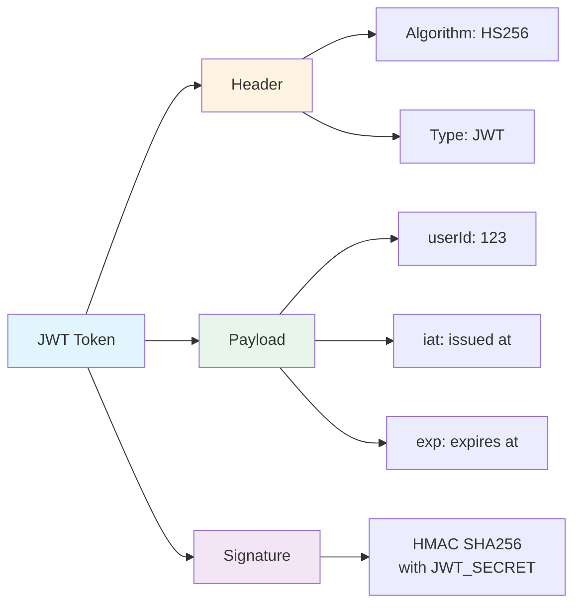
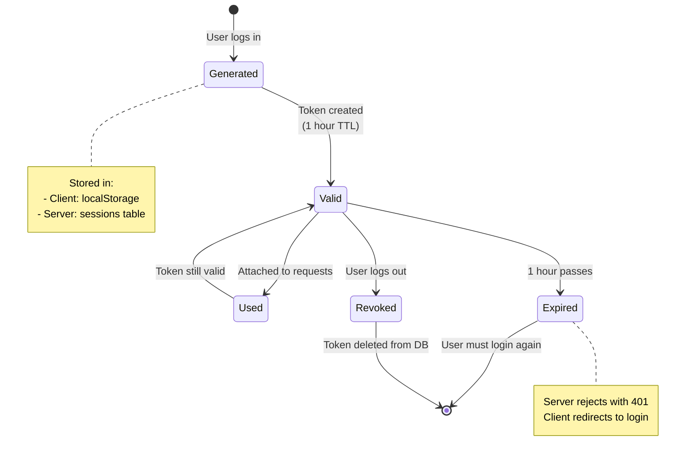
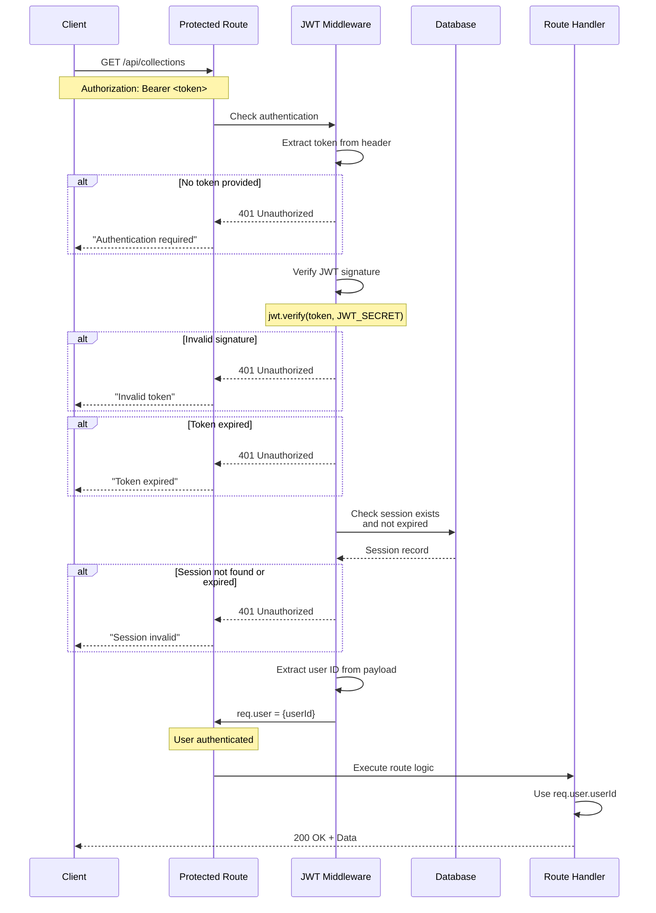
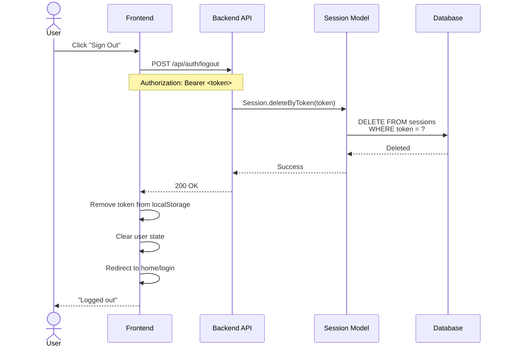
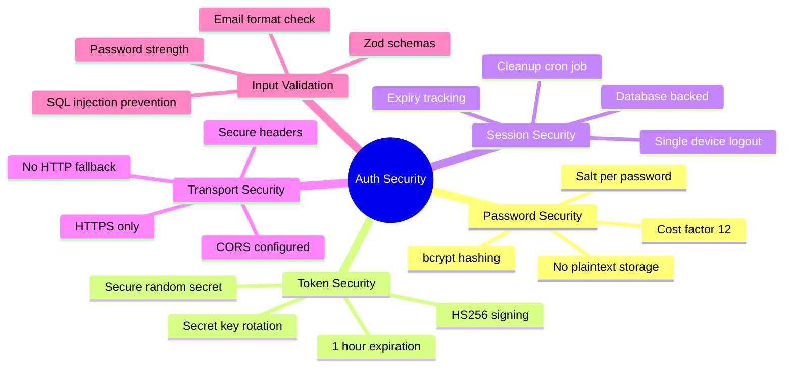

# Authentication Flow

This page details the authentication system in Crudibase, including registration, login, JWT handling, and authorization.

## Table of Contents
- [Overview](#overview)
- [User Registration](#user-registration)
- [User Login](#user-login)
- [JWT Token Management](#jwt-token-management)
- [Protected Route Access](#protected-route-access)
- [Logout Flow](#logout-flow)
- [Security Considerations](#security-considerations)

## Overview

Crudibase uses **JWT (JSON Web Tokens)** for stateless authentication with the following characteristics:

| Feature | Implementation |
|---------|----------------|
| **Token Type** | JWT (HS256 algorithm) |
| **Storage** | localStorage (client-side) |
| **Expiration** | 1 hour (configurable) |
| **Password Hashing** | bcrypt with cost factor 12 |
| **Session Management** | Database-backed (sessions table) |



## User Registration

### Registration Sequence



### Registration Validation Rules

**Email:**
```typescript
{
  format: "email",
  required: true,
  unique: true
}
```

**Password:**
```typescript
{
  minLength: 8,
  required: true,
  pattern: /^(?=.*[a-z])(?=.*[A-Z])(?=.*\d).*/  // At least one lowercase, uppercase, and digit
}
```

### API Endpoint

**POST `/api/auth/register`**

**Request:**
```json
{
  "email": "user@example.com",
  "password": "SecurePass123!"
}
```

**Success Response (201):**
```json
{
  "user": {
    "id": 1,
    "email": "user@example.com",
    "created_at": "2025-01-15T10:30:00Z"
  },
  "token": "eyJhbGciOiJIUzI1NiIsInR5cCI6IkpXVCJ9..."
}
```

**Error Responses:**
- `400 Bad Request` - Validation error
- `409 Conflict` - Email already exists
- `500 Internal Server Error` - Server error

## User Login

### Login Sequence



### Login Implementation Details

**Password Comparison:**
```typescript
// Constant-time comparison prevents timing attacks
const isValid = await bcrypt.compare(plainPassword, passwordHash);
```

**JWT Generation:**
```typescript
const token = jwt.sign(
  { userId: user.id },
  JWT_SECRET,
  { expiresIn: '1h' }  // Token expires in 1 hour
);
```

**Session Storage:**
```sql
INSERT INTO sessions (user_id, token, expires_at, created_at)
VALUES (?, ?, datetime('now', '+1 hour'), datetime('now'));
```

### API Endpoint

**POST `/api/auth/login`**

**Request:**
```json
{
  "email": "user@example.com",
  "password": "SecurePass123!"
}
```

**Success Response (200):**
```json
{
  "user": {
    "id": 1,
    "email": "user@example.com"
  },
  "token": "eyJhbGciOiJIUzI1NiIsInR5cCI6IkpXVCJ9..."
}
```

**Error Responses:**
- `400 Bad Request` - Missing email or password
- `401 Unauthorized` - Invalid credentials
- `500 Internal Server Error` - Server error

## JWT Token Management

### Token Structure



### Token Lifecycle



### Token Storage

**Client-side (Frontend):**
```typescript
// Store token after login
localStorage.setItem('token', token);

// Retrieve for API requests
const token = localStorage.getItem('token');
axios.defaults.headers.common['Authorization'] = `Bearer ${token}`;

// Clear on logout
localStorage.removeItem('token');
```

**Server-side (Database):**
```sql
CREATE TABLE sessions (
  id INTEGER PRIMARY KEY,
  user_id INTEGER NOT NULL,
  token TEXT NOT NULL,
  expires_at DATETIME NOT NULL,
  created_at DATETIME DEFAULT CURRENT_TIMESTAMP,
  FOREIGN KEY (user_id) REFERENCES users(id)
);

CREATE INDEX idx_sessions_token ON sessions(token);
CREATE INDEX idx_sessions_expires_at ON sessions(expires_at);
```

## Protected Route Access

### Authorization Middleware Flow



### Middleware Implementation

```typescript
// JWT Authentication Middleware
export const authenticateJWT = async (req, res, next) => {
  try {
    // Extract token from Authorization header
    const authHeader = req.headers.authorization;
    const token = authHeader?.split(' ')[1]; // Bearer <token>

    if (!token) {
      return res.status(401).json({ error: 'Authentication required' });
    }

    // Verify JWT signature and expiration
    const decoded = jwt.verify(token, JWT_SECRET);

    // Check session in database
    const session = await Session.findByToken(token);
    if (!session || new Date() > session.expires_at) {
      return res.status(401).json({ error: 'Session expired' });
    }

    // Attach user ID to request
    req.user = { userId: decoded.userId };
    next();
  } catch (error) {
    return res.status(401).json({ error: 'Invalid token' });
  }
};
```

### Protected Routes

**Backend routes requiring authentication:**
```typescript
// All collection endpoints require auth
router.get('/collections', authenticateJWT, listCollections);
router.post('/collections', authenticateJWT, createCollection);
router.get('/collections/:id', authenticateJWT, getCollection);
router.delete('/collections/:id', authenticateJWT, deleteCollection);

// User profile endpoints
router.get('/user/profile', authenticateJWT, getProfile);
router.put('/user/profile', authenticateJWT, updateProfile);
```

**Frontend protected routes:**
```typescript
// Protected routes (redirect to login if not authenticated)
<Route path="/dashboard" element={<ProtectedRoute><Dashboard /></ProtectedRoute>} />
<Route path="/search" element={<ProtectedRoute><SearchPage /></ProtectedRoute>} />
<Route path="/collections" element={<ProtectedRoute><CollectionsPage /></ProtectedRoute>} />
```

## Logout Flow

### Logout Sequence



### Logout Implementation

**Backend:**
```typescript
// POST /api/auth/logout
export const logout = async (req, res) => {
  try {
    const token = req.headers.authorization?.split(' ')[1];

    // Delete session from database
    await Session.deleteByToken(token);

    res.json({ message: 'Logged out successfully' });
  } catch (error) {
    res.status(500).json({ error: 'Logout failed' });
  }
};
```

**Frontend:**
```typescript
const handleLogout = async () => {
  try {
    // Call logout endpoint
    await axios.post('/api/auth/logout');

    // Clear local storage
    localStorage.removeItem('token');

    // Clear user state
    setUser(null);

    // Redirect to home
    navigate('/');
  } catch (error) {
    console.error('Logout failed:', error);
  }
};
```

## Security Considerations

### Authentication Security Measures



### Security Best Practices

**1. Password Storage:**
- ✅ Never store plaintext passwords
- ✅ Use bcrypt with high cost factor (12)
- ✅ Unique salt per password (automatic with bcrypt)
- ✅ Constant-time comparison to prevent timing attacks

**2. JWT Security:**
- ✅ Use strong secret key (256-bit random)
- ✅ Short expiration time (1 hour)
- ✅ Verify signature on every request
- ✅ Store sessions in database for revocation

**3. Token Storage:**
- ⚠️ localStorage (vulnerable to XSS)
- 🔄 **Future**: Consider httpOnly cookies for better security

**4. Rate Limiting:**
- 🔄 **Planned**: Limit login attempts (5 per minute)
- 🔄 **Planned**: Account lockout after failed attempts

**5. HTTPS:**
- ✅ All production traffic over HTTPS
- ✅ HTTP redirects to HTTPS
- ✅ HSTS headers enabled

### Known Security Limitations

| Issue | Risk Level | Mitigation | Status |
|-------|------------|------------|--------|
| localStorage for JWT | Medium | Move to httpOnly cookies | 🔄 Planned |
| No rate limiting | Medium | Add express-rate-limit | 🔄 Planned |
| No 2FA support | Low | Add TOTP in Phase 3 | 📋 Backlog |
| No email verification | Low | Add email service | 📋 Backlog |
| No password reset | Medium | Implement in Sprint 3 | ⏭️ Deferred |

## Related Pages

- [[Architecture]] - Overall system architecture
- [[API-Reference]] - All API endpoints including auth
- [[Database-Schema]] - Users and sessions tables
- [[Development-Guide]] - Testing authentication locally

---

**Last Updated**: 2025-11-17
