# Collections System

This page documents the Collections feature in Crudibase, which allows users to organize and save Wikibase entities into personal collections.

## Table of Contents
- [Overview](#overview)
- [Collection Data Model](#collection-data-model)
- [Create Collection Flow](#create-collection-flow)
- [Add Entity to Collection](#add-entity-to-collection)
- [View Collection Details](#view-collection-details)
- [Delete Operations](#delete-operations)
- [UI Components](#ui-components)

## Overview

Collections provide a way for users to curate and organize entities from Wikibase searches. Each user can create multiple collections and add entities with optional notes.

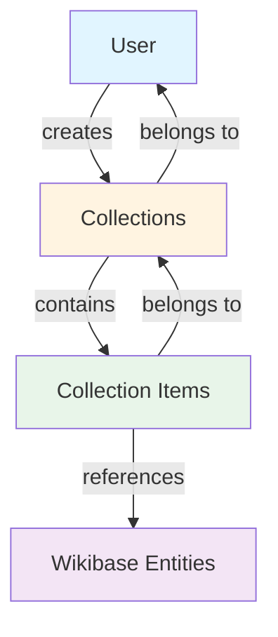

**Key Features:**
- ✅ Create named collections with descriptions
- ✅ Add entities from search results
- ✅ View collection contents
- ✅ Remove items from collections
- ✅ Delete entire collections
- ✅ Duplicate prevention (409 errors)
- 🔄 Private by default (public sharing planned for Phase 3)

## Collection Data Model

### Entity Relationship Diagram

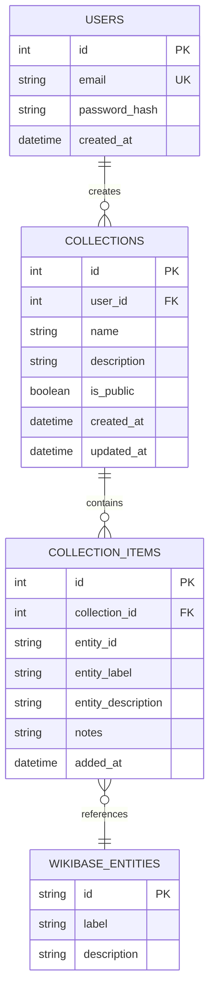

### TypeScript Interfaces

```typescript
interface Collection {
  id: number;
  user_id: number;
  name: string;
  description: string | null;
  is_public: boolean;
  created_at: string;
  updated_at: string;
}

interface CollectionItem {
  id: number;
  collection_id: number;
  entity_id: string;        // Wikidata Q-ID (e.g., "Q937")
  entity_label: string;     // Display name
  entity_description: string;
  notes: string | null;     // User's personal notes
  added_at: string;
}

interface CollectionWithCount extends Collection {
  item_count: number;       // Number of entities in collection
}
```

## Create Collection Flow

### Creation Sequence

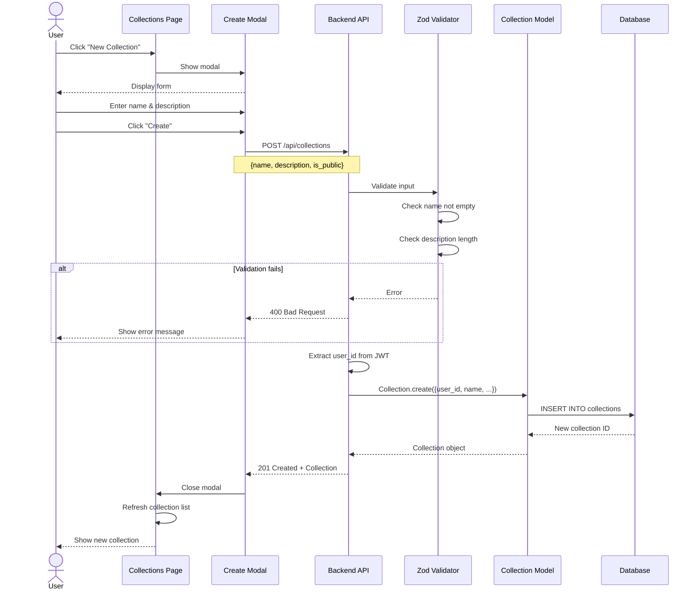

### API Endpoint

**POST `/api/collections`**

**Request:**
```json
{
  "name": "Favorite Scientists",
  "description": "Scientists I admire",
  "is_public": false
}
```

**Success Response (201):**
```json
{
  "id": 1,
  "user_id": 42,
  "name": "Favorite Scientists",
  "description": "Scientists I admire",
  "is_public": false,
  "created_at": "2025-01-15T10:30:00Z",
  "updated_at": "2025-01-15T10:30:00Z"
}
```

**Validation Rules:**
```typescript
const createCollectionSchema = z.object({
  name: z.string().min(1).max(100),
  description: z.string().max(500).optional(),
  is_public: z.boolean().default(false)
});
```

## Add Entity to Collection

### Add Entity Sequence

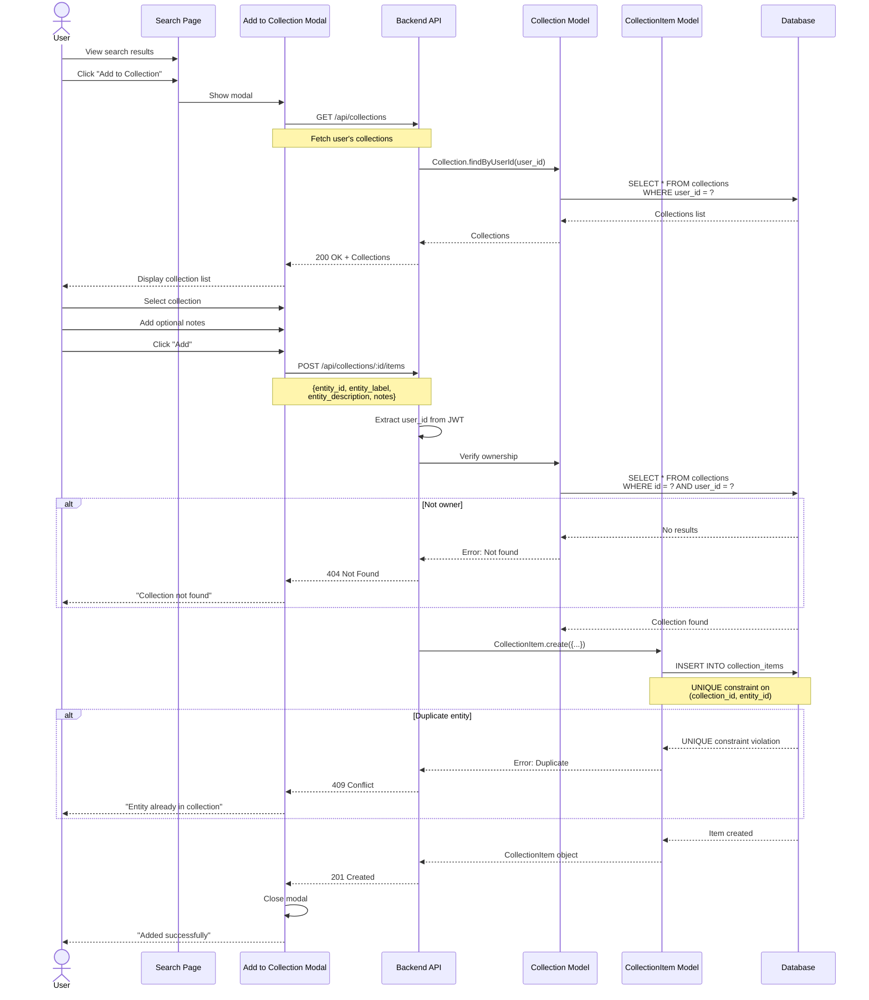

### Duplicate Prevention

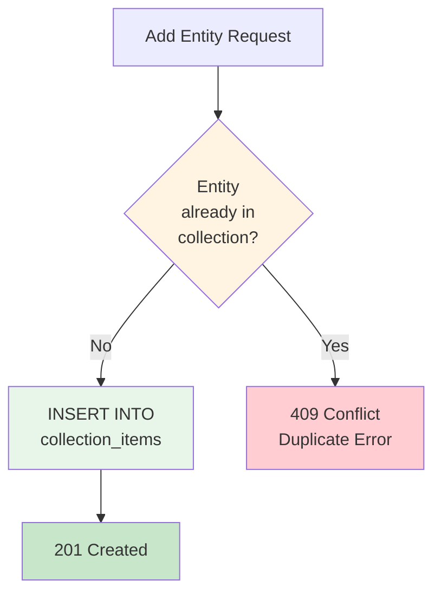

**Database Constraint:**
```sql
CREATE TABLE collection_items (
  id INTEGER PRIMARY KEY,
  collection_id INTEGER NOT NULL,
  entity_id TEXT NOT NULL,
  -- ... other fields
  UNIQUE(collection_id, entity_id)  -- Prevents duplicates
);
```

### API Endpoint

**POST `/api/collections/:id/items`**

**Request:**
```json
{
  "entity_id": "Q937",
  "entity_label": "Albert Einstein",
  "entity_description": "German-born theoretical physicist",
  "notes": "Research relativity theory"
}
```

**Success Response (201):**
```json
{
  "id": 1,
  "collection_id": 5,
  "entity_id": "Q937",
  "entity_label": "Albert Einstein",
  "entity_description": "German-born theoretical physicist",
  "notes": "Research relativity theory",
  "added_at": "2025-01-15T11:00:00Z"
}
```

**Error Responses:**
- `404 Not Found` - Collection doesn't exist or not owned by user
- `409 Conflict` - Entity already in collection
- `400 Bad Request` - Invalid entity data

## View Collection Details

### View Details Sequence

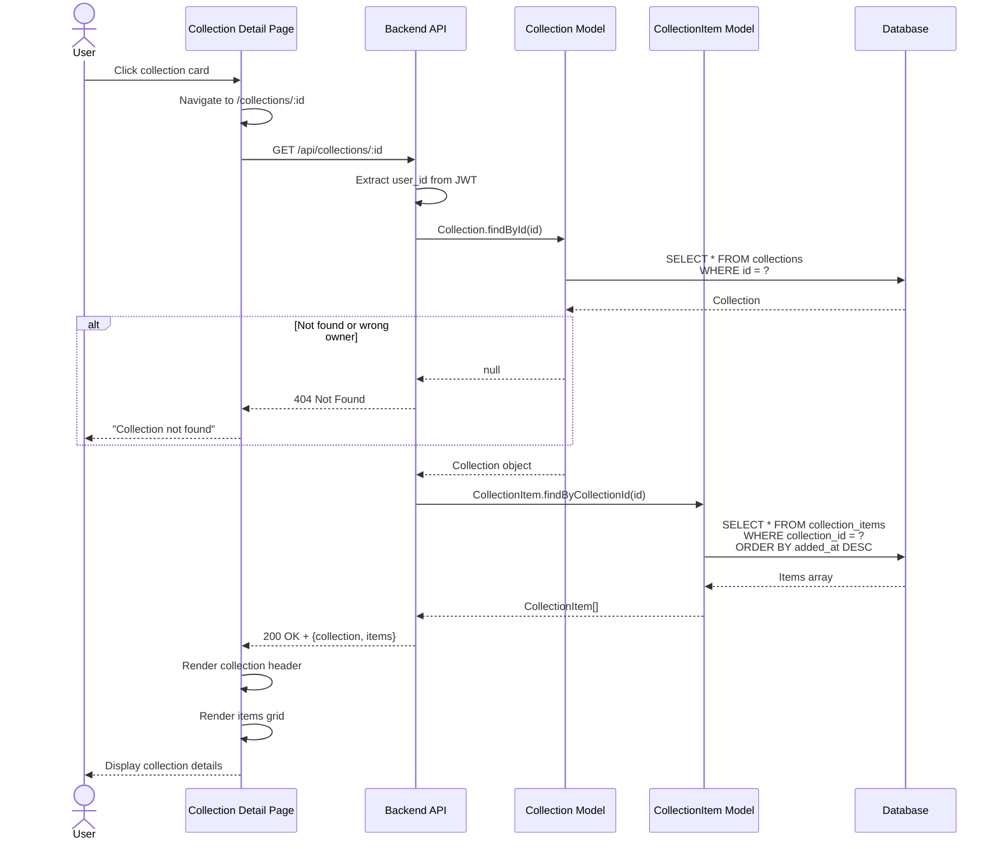

### Collection Detail Page Layout

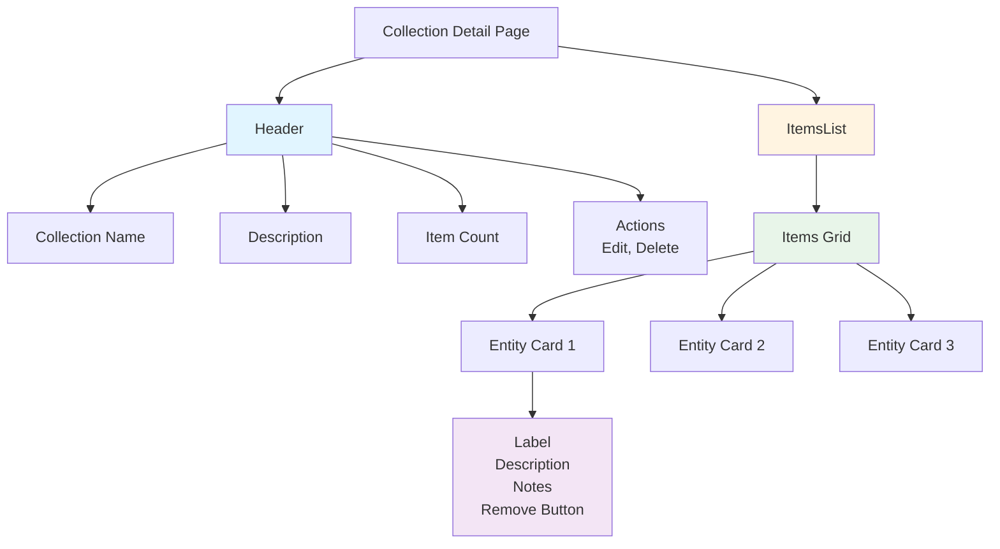

### API Endpoint

**GET `/api/collections/:id`**

**Success Response (200):**
```json
{
  "collection": {
    "id": 1,
    "name": "Favorite Scientists",
    "description": "Scientists I admire",
    "item_count": 5,
    "created_at": "2025-01-15T10:30:00Z",
    "updated_at": "2025-01-20T14:00:00Z"
  },
  "items": [
    {
      "id": 1,
      "entity_id": "Q937",
      "entity_label": "Albert Einstein",
      "entity_description": "German-born theoretical physicist",
      "notes": "Research relativity theory",
      "added_at": "2025-01-15T11:00:00Z"
    }
  ]
}
```

## Delete Operations

### Remove Item from Collection

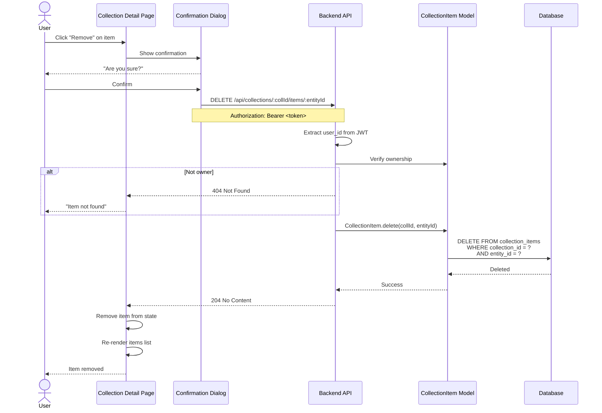

### Delete Entire Collection

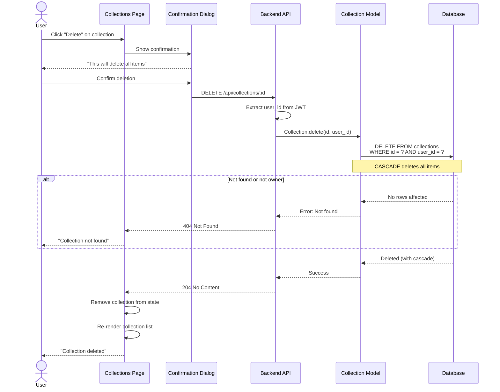

### Cascade Deletion

```sql
-- Foreign key with CASCADE ensures items are deleted
CREATE TABLE collection_items (
  id INTEGER PRIMARY KEY,
  collection_id INTEGER NOT NULL,
  -- ... other fields
  FOREIGN KEY (collection_id)
    REFERENCES collections(id)
    ON DELETE CASCADE
);
```

### API Endpoints

**DELETE `/api/collections/:collectionId/items/:entityId`**

**Success Response:** `204 No Content`

**DELETE `/api/collections/:id`**

**Success Response:** `204 No Content`

## UI Components

### Component Hierarchy

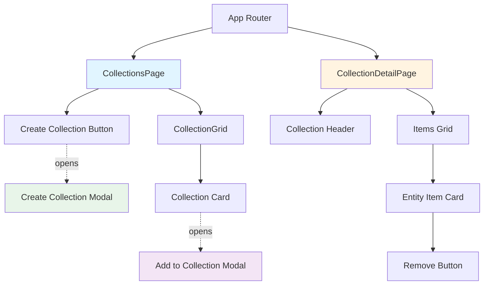

### Collections Page

**Route:** `/collections`

**Features:**
- Grid view of all user collections
- "Create Collection" button
- Collection cards showing:
  - Collection name
  - Description (truncated)
  - Item count (planned)
  - Created date
  - Edit/Delete actions

### Collection Detail Page

**Route:** `/collections/:id`

**Features:**
- Collection header with name, description, stats
- Grid of entity items
- Each item shows:
  - Entity label (linked to Wikidata)
  - Entity description
  - User notes
  - Added date
  - "Remove" button
- Back navigation to collections list

### Create Collection Modal

**Triggered by:** "New Collection" button

**Fields:**
- Name (required, max 100 chars)
- Description (optional, max 500 chars)
- Is Public (checkbox, default false)

**Actions:**
- Create (validates and submits)
- Cancel (closes modal)

### Add to Collection Modal

**Triggered by:** "Add to Collection" button on search results

**Features:**
- Fetches user's collections on open
- Dropdown/list to select collection
- "Create New Collection" option
- Notes field (optional)
- Shows duplicate error if entity already in collection

## Future Enhancements

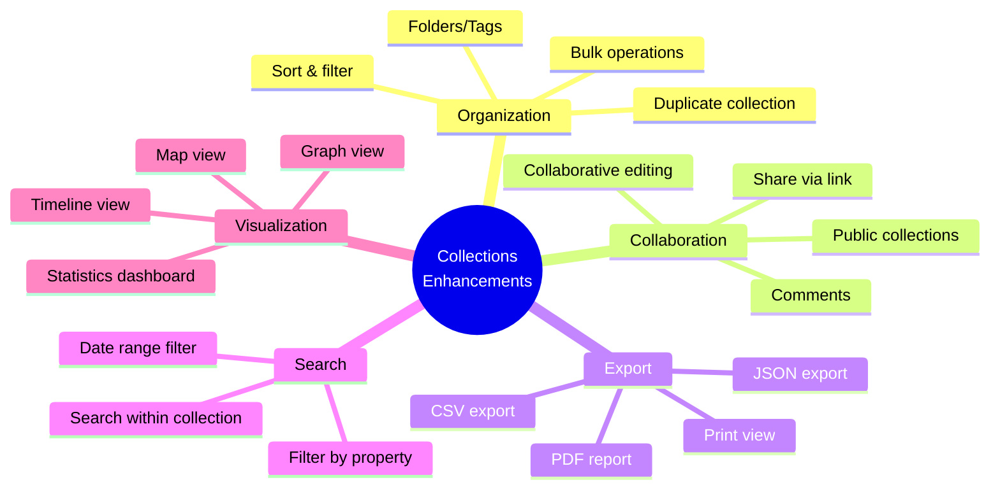

## Related Pages

- [[Architecture]] - Overall system design
- [[Authentication-Flow]] - User ownership and authorization
- [[Wikibase-Integration]] - How entities are discovered
- [[Database-Schema]] - Collections table details
- [[API-Reference]] - Complete API documentation

---

**Last Updated**: 2025-11-17
