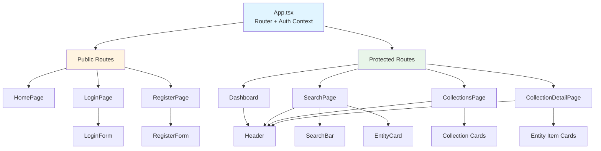
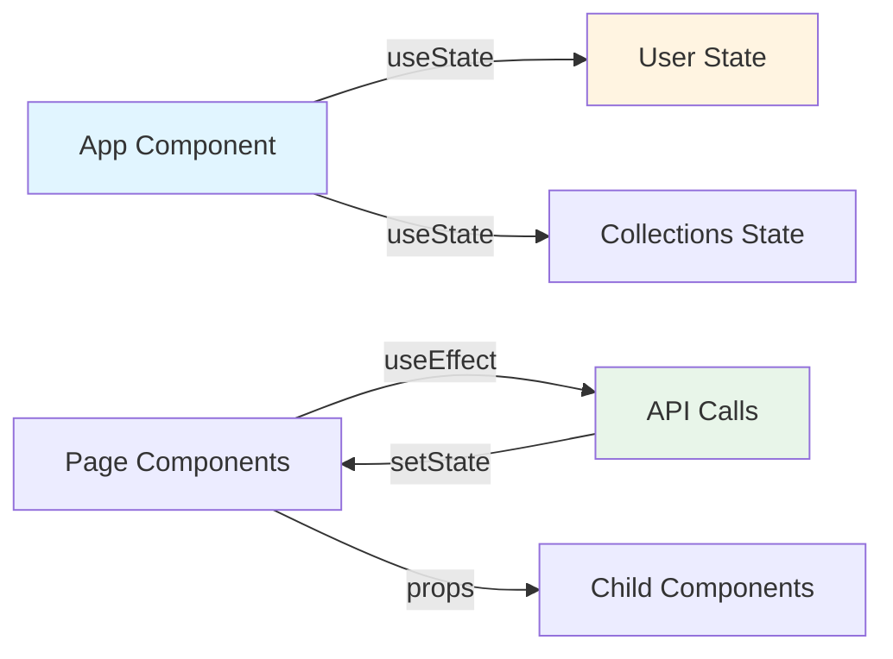
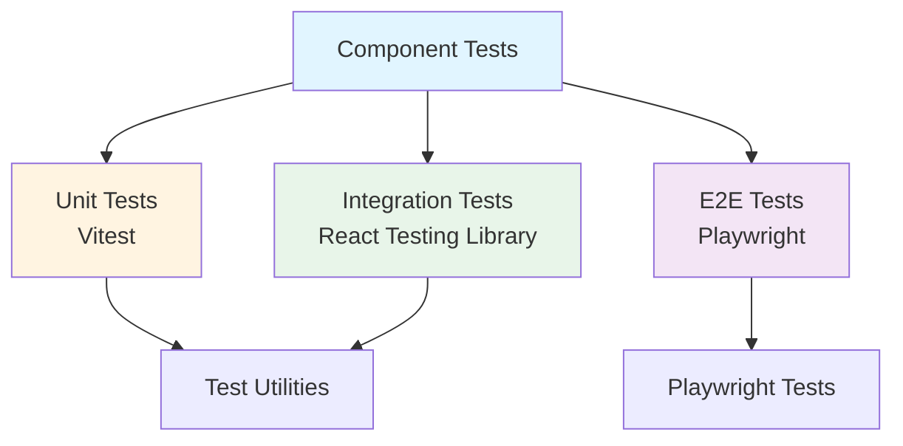

# Component Hierarchy

Frontend component organization and hierarchy in Crudibase.

## Overview

Crudibase frontend is built with React 18, TypeScript, and Tailwind CSS using a page-based component architecture.

## Directory Structure

```
src/frontend/src/
├── App.tsx                 # Root component with routing
├── pages/                  # Page-level components
│   ├── HomePage.tsx
│   ├── LoginPage.tsx
│   ├── RegisterPage.tsx
│   ├── Dashboard.tsx
│   ├── SearchPage.tsx
│   ├── CollectionsPage.tsx
│   └── CollectionDetailPage.tsx
├── components/             # Reusable components
│   ├── LoginForm.tsx
│   ├── RegisterForm.tsx
│   ├── SearchBar.tsx
│   ├── EntityCard.tsx
│   └── Header.tsx
└── test/                   # Test utilities
    └── test-utils.tsx
```

## Component Hierarchy



## Key Components

### App.tsx (Root)

```typescript
// Main app with routing and auth context
function App() {
  const [user, setUser] = useState(null);

  return (
    <Router>
      <Routes>
        {/* Public routes */}
        <Route path="/" element={<HomePage />} />
        <Route path="/login" element={<LoginPage />} />
        <Route path="/register" element={<RegisterPage />} />

        {/* Protected routes */}
        <Route path="/dashboard" element={<ProtectedRoute><Dashboard /></ProtectedRoute>} />
        <Route path="/search" element={<ProtectedRoute><SearchPage /></ProtectedRoute>} />
        <Route path="/collections" element={<ProtectedRoute><CollectionsPage /></ProtectedRoute>} />
        <Route path="/collections/:id" element={<ProtectedRoute><CollectionDetailPage /></ProtectedRoute>} />
      </Routes>
    </Router>
  );
}
```

### Pages

**HomePage**
- Landing page with login/register links
- Public, no authentication required

**LoginPage / RegisterPage**
- Contain LoginForm / RegisterForm
- Handle authentication state
- Redirect to dashboard on success

**Dashboard**
- Main landing page after login
- Shows user info and quick actions
- Links to search and collections

**SearchPage**
- Contains SearchBar component
- Displays search results as EntityCard components
- "Add to Collection" functionality

**CollectionsPage**
- Grid of user's collections
- "Create Collection" button
- Collection cards with name, description, item count

**CollectionDetailPage**
- Shows single collection details
- Lists all entities in collection
- Remove entity functionality

### Reusable Components

**Header**
```typescript
interface HeaderProps {
  user: User | null;
  onLogout: () => void;
}

// Navigation bar with links and user menu
function Header({ user, onLogout }: HeaderProps) {
  return (
    <nav>
      {/* Logo, navigation links, user menu */}
    </nav>
  );
}
```

**LoginForm / RegisterForm**
```typescript
interface AuthFormProps {
  onSubmit: (data: { email: string; password: string }) => Promise<void>;
  error?: string;
}

// Form with validation and error display
function LoginForm({ onSubmit, error }: AuthFormProps) {
  // Form state, validation, submit handling
}
```

**SearchBar**
```typescript
interface SearchBarProps {
  onSearch: (query: string) => void;
  loading?: boolean;
}

// Debounced search input
function SearchBar({ onSearch, loading }: SearchBarProps) {
  // Debounce logic, loading state
}
```

**EntityCard**
```typescript
interface EntityCardProps {
  entity: WikibaseEntity;
  onAddToCollection?: (entity: WikibaseEntity) => void;
}

// Display entity with "Add to Collection" button
function EntityCard({ entity, onAddToCollection }: EntityCardProps) {
  return (
    <div className="card">
      <h3>{entity.label}</h3>
      <p>{entity.description}</p>
      <button onClick={() => onAddToCollection?.(entity)}>
        Add to Collection
      </button>
    </div>
  );
}
```

## State Management

Currently using **React hooks and Context API**:



**Future**: May migrate to Zustand for more complex state management.

## Routing Structure

```
/                           # Home page (public)
/login                      # Login page (public)
/register                   # Register page (public)
/dashboard                  # Dashboard (protected)
/search                     # Search page (protected)
/collections                # Collections list (protected)
/collections/:id            # Collection detail (protected)
```

**Protected Routes:**
- Check for JWT token in localStorage
- Redirect to `/login` if not authenticated
- Include `Authorization` header in all API calls

## Styling Approach

**Tailwind CSS** with utility-first classes:

```typescript
// Example component
function EntityCard({ entity }: EntityCardProps) {
  return (
    <div className="bg-white rounded-lg shadow-md p-6 hover:shadow-lg transition-shadow">
      <h3 className="text-lg font-semibold text-gray-900">
        {entity.label}
      </h3>
      <p className="text-sm text-gray-600 mt-2">
        {entity.description}
      </p>
      <button className="mt-4 px-4 py-2 bg-blue-600 text-white rounded hover:bg-blue-700">
        Add to Collection
      </button>
    </div>
  );
}
```

## Testing Structure



**Test Files:**
- Co-located with components: `ComponentName.test.tsx`
- E2E tests: `src/frontend/__tests__/e2e/*.spec.ts`

## Future Enhancements

**Planned Components:**
- `CollectionCard` - Dedicated collection card component
- `Modal` - Reusable modal component
- `Toast` - Notification toast component
- `EntityDetail` - Full entity detail view
- `RelationshipGraph` - Interactive graph visualization
- `Timeline` - Chronological entity timeline

## Related Pages

- [[Architecture]] - Overall system architecture
- [[Development-Guide]] - Setup and development workflow
- [[API-Reference]] - Backend API integration

---

**Last Updated**: 2025-11-17
