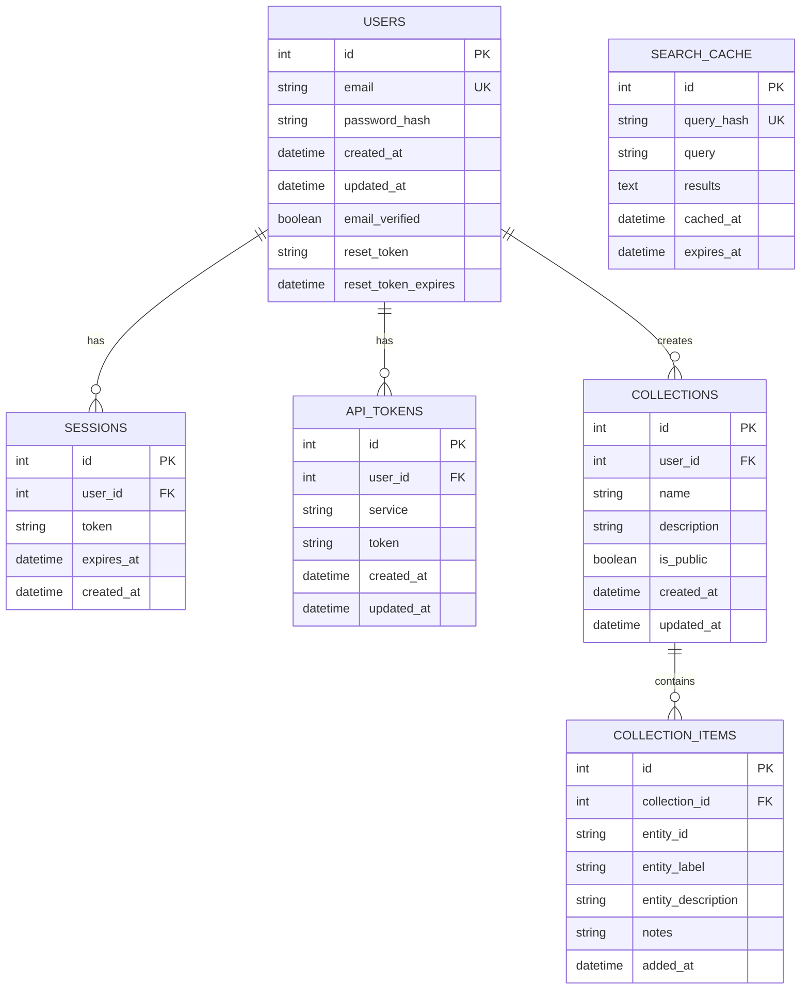
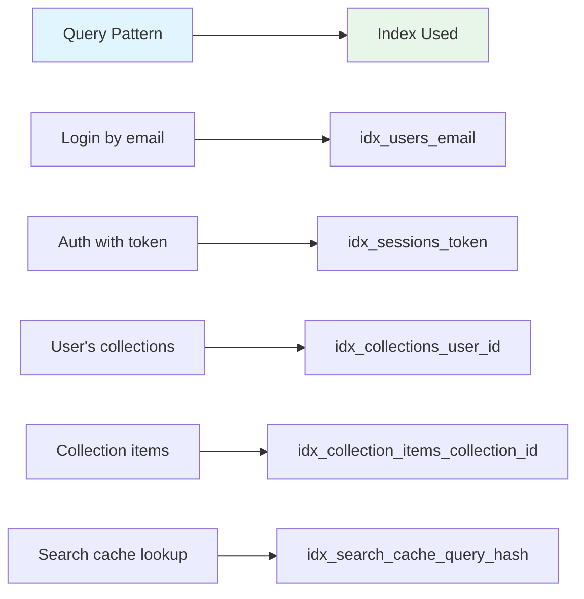
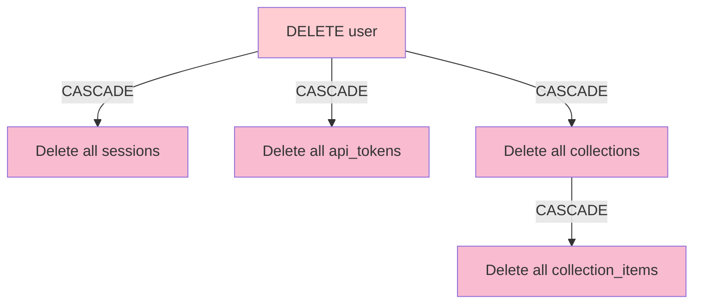
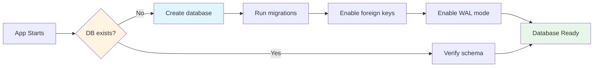
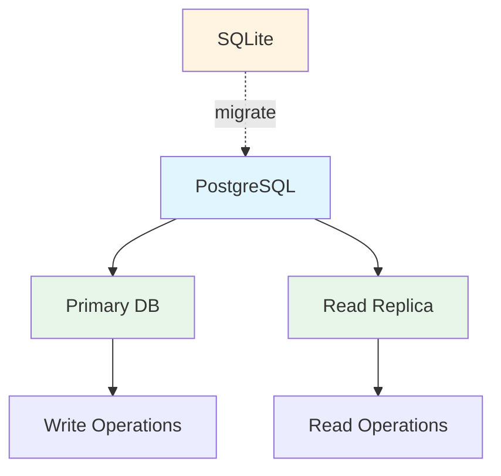

# Database Schema

Complete database schema documentation for Crudibase's SQLite database.

## Table of Contents
- [Overview](#overview)
- [Entity Relationship Diagram](#entity-relationship-diagram)
- [Table Definitions](#table-definitions)
- [Indexes](#indexes)
- [Data Access Patterns](#data-access-patterns)

## Overview

Crudibase uses **SQLite3** with **better-sqlite3** (synchronous API) for data persistence.

**Database Location:**
- Development: `src/backend/data/crudibase.dev.db`
- Testing: `:memory:` (in-memory)
- Production: Docker volume `/app/src/backend/data/crudibase.db`

**Key Characteristics:**
- **WAL mode** for better concurrency
- **Foreign keys enabled**
- **Automatic timestamps**
- **Cascade deletes** for related records

## Entity Relationship Diagram



## Table Definitions

### users

Stores user account information.

```sql
CREATE TABLE users (
  id INTEGER PRIMARY KEY AUTOINCREMENT,
  email TEXT UNIQUE NOT NULL,
  password_hash TEXT,  -- Nullable for future OAuth users
  created_at DATETIME DEFAULT CURRENT_TIMESTAMP,
  updated_at DATETIME DEFAULT CURRENT_TIMESTAMP,
  email_verified BOOLEAN DEFAULT 0,
  reset_token TEXT,
  reset_token_expires DATETIME
);

CREATE INDEX idx_users_email ON users(email);
CREATE INDEX idx_users_reset_token ON users(reset_token);
```

**Columns:**
| Column | Type | Constraints | Description |
|--------|------|-------------|-------------|
| `id` | INTEGER | PRIMARY KEY | Auto-increment user ID |
| `email` | TEXT | UNIQUE, NOT NULL | User's email address |
| `password_hash` | TEXT | NULL allowed | bcrypt hash (cost 12) |
| `created_at` | DATETIME | DEFAULT NOW | Account creation timestamp |
| `updated_at` | DATETIME | DEFAULT NOW | Last modification timestamp |
| `email_verified` | BOOLEAN | DEFAULT 0 | Email verification status |
| `reset_token` | TEXT | NULL | Password reset token |
| `reset_token_expires` | DATETIME | NULL | Reset token expiration |

### sessions

Tracks active user sessions and JWT tokens.

```sql
CREATE TABLE sessions (
  id INTEGER PRIMARY KEY AUTOINCREMENT,
  user_id INTEGER NOT NULL,
  token TEXT NOT NULL,
  expires_at DATETIME NOT NULL,
  created_at DATETIME DEFAULT CURRENT_TIMESTAMP,
  FOREIGN KEY (user_id) REFERENCES users(id) ON DELETE CASCADE
);

CREATE INDEX idx_sessions_token ON sessions(token);
CREATE INDEX idx_sessions_user_id ON sessions(user_id);
CREATE INDEX idx_sessions_expires_at ON sessions(expires_at);
```

**Columns:**
| Column | Type | Constraints | Description |
|--------|------|-------------|-------------|
| `id` | INTEGER | PRIMARY KEY | Session ID |
| `user_id` | INTEGER | FOREIGN KEY | References users.id |
| `token` | TEXT | NOT NULL | JWT token string |
| `expires_at` | DATETIME | NOT NULL | Token expiration time |
| `created_at` | DATETIME | DEFAULT NOW | Session start time |

**Cleanup:** Expired sessions cleaned periodically via cron job.

### api_tokens

Stores user API tokens for external services (e.g., Wikibase).

```sql
CREATE TABLE api_tokens (
  id INTEGER PRIMARY KEY AUTOINCREMENT,
  user_id INTEGER NOT NULL,
  service TEXT NOT NULL,  -- 'wikibase', 'google', etc.
  token TEXT NOT NULL,    -- Encrypted
  created_at DATETIME DEFAULT CURRENT_TIMESTAMP,
  updated_at DATETIME DEFAULT CURRENT_TIMESTAMP,
  FOREIGN KEY (user_id) REFERENCES users(id) ON DELETE CASCADE,
  UNIQUE(user_id, service)
);

CREATE INDEX idx_api_tokens_user_id ON api_tokens(user_id);
```

**Columns:**
| Column | Type | Constraints | Description |
|--------|------|-------------|-------------|
| `id` | INTEGER | PRIMARY KEY | Token ID |
| `user_id` | INTEGER | FOREIGN KEY | References users.id |
| `service` | TEXT | NOT NULL | Service name (wikibase, google) |
| `token` | TEXT | NOT NULL | Encrypted token value |
| `created_at` | DATETIME | DEFAULT NOW | Creation timestamp |
| `updated_at` | DATETIME | DEFAULT NOW | Last update timestamp |

**Note:** Currently not used in MVP (Wikidata access is unauthenticated).

### collections

User-created collections of entities.

```sql
CREATE TABLE collections (
  id INTEGER PRIMARY KEY AUTOINCREMENT,
  user_id INTEGER NOT NULL,
  name TEXT NOT NULL,
  description TEXT,
  is_public BOOLEAN DEFAULT 0,
  created_at DATETIME DEFAULT CURRENT_TIMESTAMP,
  updated_at DATETIME DEFAULT CURRENT_TIMESTAMP,
  FOREIGN KEY (user_id) REFERENCES users(id) ON DELETE CASCADE
);

CREATE INDEX idx_collections_user_id ON collections(user_id);
CREATE INDEX idx_collections_public ON collections(is_public);
```

**Columns:**
| Column | Type | Constraints | Description |
|--------|------|-------------|-------------|
| `id` | INTEGER | PRIMARY KEY | Collection ID |
| `user_id` | INTEGER | FOREIGN KEY | References users.id (owner) |
| `name` | TEXT | NOT NULL | Collection name (max 100 chars) |
| `description` | TEXT | NULL | Optional description (max 500) |
| `is_public` | BOOLEAN | DEFAULT 0 | Public visibility flag |
| `created_at` | DATETIME | DEFAULT NOW | Creation timestamp |
| `updated_at` | DATETIME | DEFAULT NOW | Last modification timestamp |

### collection_items

Entities saved within collections.

```sql
CREATE TABLE collection_items (
  id INTEGER PRIMARY KEY AUTOINCREMENT,
  collection_id INTEGER NOT NULL,
  entity_id TEXT NOT NULL,  -- Wikibase Q-ID (e.g., 'Q937')
  entity_label TEXT,
  entity_description TEXT,
  notes TEXT,               -- User's personal notes
  added_at DATETIME DEFAULT CURRENT_TIMESTAMP,
  FOREIGN KEY (collection_id) REFERENCES collections(id) ON DELETE CASCADE,
  UNIQUE(collection_id, entity_id)  -- Prevent duplicates
);

CREATE INDEX idx_collection_items_collection_id ON collection_items(collection_id);
CREATE INDEX idx_collection_items_entity_id ON collection_items(entity_id);
```

**Columns:**
| Column | Type | Constraints | Description |
|--------|------|-------------|-------------|
| `id` | INTEGER | PRIMARY KEY | Item ID |
| `collection_id` | INTEGER | FOREIGN KEY | References collections.id |
| `entity_id` | TEXT | NOT NULL | Wikidata entity ID (Q937) |
| `entity_label` | TEXT | NULL | Cached entity label |
| `entity_description` | TEXT | NULL | Cached entity description |
| `notes` | TEXT | NULL | User's personal notes |
| `added_at` | DATETIME | DEFAULT NOW | When added to collection |

**Constraint:** `UNIQUE(collection_id, entity_id)` prevents duplicate entities in same collection.

### search_cache

Caches Wikibase search results to reduce API calls.

```sql
CREATE TABLE search_cache (
  id INTEGER PRIMARY KEY AUTOINCREMENT,
  query_hash TEXT UNIQUE NOT NULL,
  query TEXT NOT NULL,
  results TEXT NOT NULL,  -- JSON string
  cached_at DATETIME DEFAULT CURRENT_TIMESTAMP,
  expires_at DATETIME NOT NULL
);

CREATE INDEX idx_search_cache_query_hash ON search_cache(query_hash);
CREATE INDEX idx_search_cache_expires_at ON search_cache(expires_at);
```

**Columns:**
| Column | Type | Constraints | Description |
|--------|------|-------------|-------------|
| `id` | INTEGER | PRIMARY KEY | Cache entry ID |
| `query_hash` | TEXT | UNIQUE, NOT NULL | SHA-256 hash of query |
| `query` | TEXT | NOT NULL | Original search query |
| `results` | TEXT | NOT NULL | JSON array of entities |
| `cached_at` | DATETIME | DEFAULT NOW | Cache creation time |
| `expires_at` | DATETIME | NOT NULL | Cache expiration time |

**TTL:** 24 hours (configurable)

## Indexes

### Performance Indexes



**Index Strategy:**
1. **Foreign keys** - Indexed for JOIN performance
2. **Lookups** - email, token, query_hash (UNIQUE)
3. **Expiration** - expires_at for cleanup queries
4. **Filtering** - is_public for future public collections

## Data Access Patterns

### User Authentication

```sql
-- Login: Find user by email
SELECT id, email, password_hash
FROM users
WHERE email = ?;
-- Uses: idx_users_email

-- Verify session
SELECT user_id, expires_at
FROM sessions
WHERE token = ? AND expires_at > datetime('now');
-- Uses: idx_sessions_token, idx_sessions_expires_at
```

### Collections Access

```sql
-- List user's collections with item counts
SELECT
  c.id, c.name, c.description, c.created_at,
  COUNT(ci.id) as item_count
FROM collections c
LEFT JOIN collection_items ci ON c.id = ci.collection_id
WHERE c.user_id = ?
GROUP BY c.id
ORDER BY c.created_at DESC;
-- Uses: idx_collections_user_id

-- Get collection with items
SELECT * FROM collections WHERE id = ? AND user_id = ?;
SELECT * FROM collection_items WHERE collection_id = ? ORDER BY added_at DESC;
-- Uses: idx_collection_items_collection_id
```

### Search Caching

```sql
-- Check cache
SELECT results
FROM search_cache
WHERE query_hash = ? AND expires_at > datetime('now');
-- Uses: idx_search_cache_query_hash

-- Store in cache
INSERT INTO search_cache (query_hash, query, results, expires_at)
VALUES (?, ?, ?, datetime('now', '+24 hours'));
```

### Cascade Deletions



**Cascade Behavior:**
```sql
-- When user is deleted
DELETE FROM users WHERE id = 42;
-- Automatically deletes:
-- - All sessions for user 42
-- - All api_tokens for user 42
-- - All collections owned by user 42
--   - All collection_items in those collections
```

## Database Initialization

### Migration System



**Initialization Code:**
```typescript
// src/backend/src/utils/database.ts

export function initDatabase(dbPath?: string): Database {
  const db = new Database(dbPath || './data/crudibase.db');

  // Enable foreign keys
  db.pragma('foreign_keys = ON');

  // Enable WAL mode for better concurrency
  db.pragma('journal_mode = WAL');

  return db;
}

export function runMigrations(db: Database): void {
  // Run all migration files in order
  const migrations = [
    '001_create_users.sql',
    '002_create_sessions.sql',
    '003_create_collections.sql',
    '004_create_search_cache.sql'
  ];

  migrations.forEach(file => {
    const sql = fs.readFileSync(`./migrations/${file}`, 'utf8');
    db.exec(sql);
  });
}
```

## Backup Strategy

### Production Backups

```bash
# Daily backup script (cron: 0 2 * * *)
#!/bin/bash
BACKUP_DIR="/opt/crudibase/backups"
DATE=$(date +%Y%m%d_%H%M%S)

# Create backup
sqlite3 /app/data/crudibase.db ".backup '$BACKUP_DIR/backup-$DATE.db'"

# Keep last 7 days
find $BACKUP_DIR -name "backup-*.db" -mtime +7 -delete
```

### Restore Process

```bash
# Stop application
docker compose down

# Restore from backup
cp /opt/crudibase/backups/backup-20250115.db /app/data/crudibase.db

# Restart application
docker compose up -d
```

## Future Considerations

### Scaling Options

**Current (MVP):**
- Single SQLite file
- Sufficient for 100s-1000s of users
- WAL mode for concurrent reads

**If Scaling Needed:**


**Migration Path:**
1. Keep SQLite for MVP
2. Use [pgloader](https://pgloader.io/) for SQLite → PostgreSQL migration
3. Update connection strings in code
4. Add read replicas for scale

## Related Pages

- [[Architecture]] - Database in system context
- [[Authentication-Flow]] - users & sessions usage
- [[Collections-System]] - collections & items usage
- [[API-Reference]] - API endpoints mapping to tables

---

**Last Updated**: 2025-11-17
