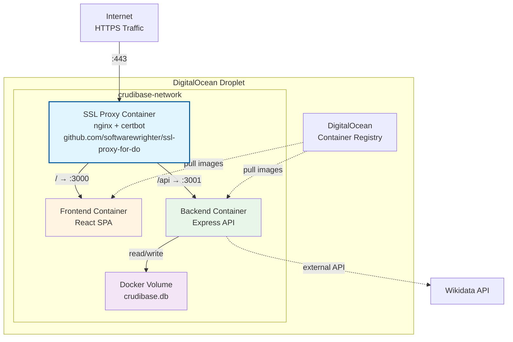
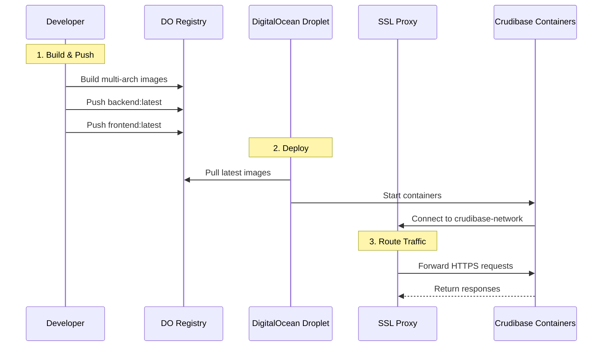
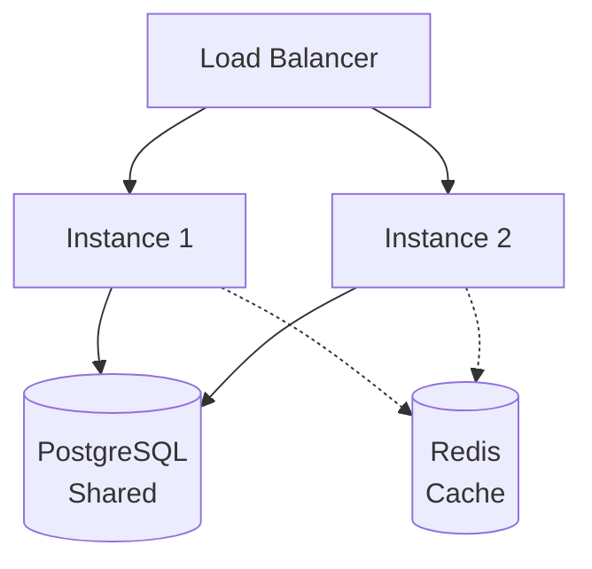

# Deployment Architecture

Production deployment architecture for Crudibase on DigitalOcean.

## Current Production Setup



## Key Architecture Points

### SSL Proxy (Separate Repository)

**Repository**: [ssl-proxy-for-do](https://github.com/softwarewrighter/ssl-proxy-for-do)

- **Purpose**: SSL termination and reverse proxy
- **Technology**: nginx + certbot
- **Certificates**: Let's Encrypt (auto-renewal)
- **Ports**: Exposes 80 (HTTP) and 443 (HTTPS)
- **Routing**:
  - `https://crudibase.codingtech.info/` → Frontend (:3000 internal)
  - `https://crudibase.codingtech.info/api/*` → Backend (:3001 internal)

**Important**: SSL proxy docs belong in its own repository, not in Crudibase.

### Application Containers

**Frontend:**
- Nginx serving static React build
- **No external ports** (only accessible via proxy)
- Connected to `crudibase-network`

**Backend:**
- Node.js Express server
- **No external ports** (only accessible via proxy)
- Connected to `crudibase-network`
- Accesses Docker volume for database

### Docker Compose Structure

```yaml
# docker-compose.prod.yml (simplified)
version: '3.8'

services:
  backend:
    image: registry.digitalocean.com/crudibase-registry/crudibase-backend:latest
    networks:
      - crudibase-network
    volumes:
      - backend-data:/app/src/backend/data

  frontend:
    image: registry.digitalocean.com/crudibase-registry/crudibase-frontend:latest
    networks:
      - crudibase-network
    depends_on:
      - backend

networks:
  crudibase-network:
    external: true  # Created by ssl-proxy-for-do

volumes:
  backend-data:
```

## Deployment Flow



### Step-by-Step Deployment

**1. Build and Push Images (from development machine):**
```bash
# Authenticate with DO registry
doctl registry login

# Build and push
./scripts/deploy-to-registry.sh
```

**2. Deploy on Droplet:**
```bash
# SSH to droplet
ssh root@droplet-ip

# Pull latest images
cd /opt/crudibase
docker compose -f docker-compose.prod.yml pull

# Restart containers
docker compose -f docker-compose.prod.yml up -d

# Check logs
docker compose -f docker-compose.prod.yml logs -f
```

## Development vs Production

| Aspect | Development | Production |
|--------|-------------|------------|
| **SSL** | No SSL | HTTPS via Let's Encrypt |
| **Ports** | 3000, 3001 exposed | No exposed ports |
| **Proxy** | Optional dev proxy | nginx + certbot (required) |
| **Database** | Local file or `:memory:` | Docker volume |
| **Hot Reload** | Yes (nodemon, Vite HMR) | No |
| **Images** | Built locally | Pulled from registry |
| **Network** | Docker bridge | External network (ssl-proxy) |

## Monitoring & Maintenance

### Health Checks

```yaml
# Backend healthcheck
healthcheck:
  test: ["CMD", "wget", "--quiet", "--tries=1", "--spider", "http://localhost:3001/health"]
  interval: 30s
  timeout: 10s
  retries: 3

# Frontend healthcheck
healthcheck:
  test: ["CMD", "wget", "--quiet", "--tries=1", "--spider", "http://127.0.0.1:3000/"]
  interval: 30s
  timeout: 3s
  retries: 3
```

### Database Backups

```bash
# Daily backup script (cron: 0 2 * * *)
docker exec crudibase-backend \
  sqlite3 /app/src/backend/data/crudibase.db \
  ".backup '/app/src/backend/data/backup-$(date +%Y%m%d).db'"

# Copy to host
docker cp crudibase-backend:/app/src/backend/data/backup-$(date +%Y%m%d).db ./backups/
```

### Log Access

```bash
# All logs
docker compose -f docker-compose.prod.yml logs -f

# Specific service
docker compose -f docker-compose.prod.yml logs -f backend
docker compose -f docker-compose.prod.yml logs -f frontend
```

## Security Considerations

1. **Network Isolation**: Application containers not exposed to internet
2. **SSL Termination**: All traffic encrypted via HTTPS
3. **Firewall**: Only ports 22 (SSH), 80 (HTTP), 443 (HTTPS) open
4. **Image Registry**: Private DigitalOcean Container Registry
5. **Secrets Management**: Environment variables in `.env` file (chmod 600)

## Scaling Considerations

**Current Setup:**
- Single droplet
- Sufficient for 100s-1000s of users

**Future Scaling:**


## Related Pages

- [[Architecture]] - Overall system design
- [[Development-Guide]] - Local development setup
- [[Database-Schema]] - Database backup/restore

---

**Last Updated**: 2025-11-17
