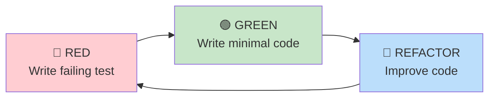

# Development Guide

Quick start guide for setting up and developing Crudibase locally.

## Prerequisites

- **Node.js 22 LTS** (required for better-sqlite3)
- **npm** (comes with Node.js)
- **Git**
- **Docker** (optional, for containerized development)

## Quick Start

### 1. Clone Repository

```bash
git clone https://github.com/softwarewrighter/crudibase.git
cd crudibase
```

### 2. Setup Node.js 22

```bash
# Using nvm (recommended)
nvm use 22

# Or run the setup script
./scripts/dev-setup.sh
```

**Critical**: This project uses `better-sqlite3` which requires exact Node.js version matching.

### 3. Install Dependencies

```bash
npm install
```

This installs dependencies for both frontend and backend workspaces.

### 4. Run Development Servers

```bash
# Start both frontend and backend
npm run dev

# Or start individually
npm run dev:backend   # Port 3001
npm run dev:frontend  # Port 3000
```

### 5. Access Application

- **Frontend**: http://localhost:3000
- **Backend API**: http://localhost:3001/api/health

## Project Structure

```
crudibase/
├── src/
│   ├── backend/          # Express API (port 3001)
│   │   ├── src/
│   │   │   ├── index.ts           # Express app
│   │   │   ├── models/            # Data models
│   │   │   ├── services/          # Business logic
│   │   │   ├── routes/            # API routes
│   │   │   └── utils/             # Utilities
│   │   ├── data/                  # SQLite database
│   │   └── __tests__/             # Integration tests
│   └── frontend/         # React SPA (port 3000)
│       ├── src/
│       │   ├── App.tsx            # Main app
│       │   ├── components/        # React components
│       │   ├── pages/             # Page components
│       │   └── test/              # Test utilities
│       └── __tests__/             # E2E tests
├── docs/                 # Documentation
├── scripts/              # Setup and deployment scripts
├── package.json          # Root package.json (workspaces)
└── CLAUDE.md             # Project instructions for AI
```

## Common Commands

### Development

```bash
# Start dev servers
npm run dev                 # Both frontend & backend
npm run dev:backend         # Backend only
npm run dev:frontend        # Frontend only

# Build for production
npm run build               # Build both
npm run build:backend       # Backend only
npm run build:frontend      # Frontend only
```

### Testing

```bash
# Run all tests
npm test

# Backend tests
npm run test:backend
cd src/backend && npm run test:watch  # Watch mode

# Frontend tests
npm run test:frontend
cd src/frontend && npm run test:watch # Watch mode

# E2E tests
npm run test:e2e
npm run test:e2e:headed    # See browser
npm run test:e2e:debug     # Debug mode

# Coverage
npm run test:coverage       # Must be >80%
```

### Code Quality

```bash
# Lint
npm run lint
npm run lint:fix

# Format
npm run format

# Type check
npm run type-check
```

## TDD Workflow

Crudibase uses **strict Test-Driven Development**. Always write tests first!

### RED-GREEN-REFACTOR Cycle



### Example TDD Flow

**1. RED - Write failing test:**
```typescript
// src/backend/src/services/AuthService.test.ts
describe('AuthService', () => {
  it('should register user with hashed password', async () => {
    const result = await authService.register({
      email: 'test@example.com',
      password: 'SecurePass123!'
    });

    expect(result.user.email).toBe('test@example.com');
    expect(result.token).toBeDefined();
  });
});

// Run: cd src/backend && npm test
// Result: ❌ Test fails (method doesn't exist)
```

**2. GREEN - Write minimal code:**
```typescript
// src/backend/src/services/AuthService.ts
class AuthService {
  async register(input: RegisterInput) {
    const password_hash = await bcrypt.hash(input.password, 12);
    const user = await User.create({ ...input, password_hash });
    const token = generateToken(user.id);
    return { user, token };
  }
}

// Run: cd src/backend && npm test
// Result: ✅ Test passes
```

**3. REFACTOR - Improve code:**
```typescript
// Add validation, error handling, more tests
// Keep tests green while refactoring
```

## Database Setup

### Automatic Initialization

Database is created automatically on first run:

```typescript
// src/backend/src/utils/database.ts
export function initDatabase() {
  const db = new Database('./data/crudibase.db');
  db.pragma('foreign_keys = ON');
  runMigrations(db);
  return db;
}
```

### Manual Database Operations

```bash
# View database schema
sqlite3 src/backend/data/crudibase.db ".schema"

# Query data
sqlite3 src/backend/data/crudibase.db "SELECT * FROM users;"

# Reset database (WARNING: deletes all data)
rm src/backend/data/crudibase.db
npm run dev:backend  # Will recreate
```

## Environment Variables

### Backend (.env)

```bash
# src/backend/.env (gitignored)
NODE_ENV=development
JWT_SECRET=your-dev-secret-here
JWT_EXPIRES_IN=1h
DATABASE_PATH=./data/crudibase.db
```

### Frontend (.env)

```bash
# src/frontend/.env (gitignored)
VITE_API_URL=http://localhost:3001
```

## Troubleshooting

### Node Version Mismatch

**Error:** `NODE_MODULE_VERSION mismatch`

**Fix:**
```bash
nvm use 22
npm rebuild better-sqlite3 --workspace=src/backend
```

### Database Locked

**Error:** `database is locked`

**Fix:**
```bash
# Kill all node processes
pkill -f node

# Restart dev server
npm run dev:backend
```

### Port Already in Use

**Error:** `Port 3000/3001 already in use`

**Fix:**
```bash
# Find process using port
lsof -i :3000

# Kill process
kill -9 <PID>
```

### Tests Failing

**Check:**
1. Node version is 22 (`node -v`)
2. Dependencies installed (`npm install`)
3. Database not corrupted (delete and recreate)
4. No zombie processes running

## Git Workflow

### Branch Strategy

```bash
# Create feature branch
git checkout -b feature/my-feature

# Make changes, commit frequently
git add .
git commit -m "feat: add new feature"

# Push to remote
git push -u origin feature/my-feature

# Create PR on GitHub
```

### Commit Message Format

```
type(scope): subject

Types: feat, fix, docs, style, refactor, test, chore
Examples:
  feat(auth): add password reset flow
  fix(collections): prevent duplicate entities
  docs: update API documentation
  test(backend): add auth service tests
```

## Docker Development (Optional)

### Using Docker Compose

```bash
# Build and start containers
docker compose up

# Rebuild after changes
docker compose build

# Stop containers
docker compose down

# View logs
docker compose logs -f
```

### Dev Proxy for Testing

Test production-like routing locally:

```bash
# Start with dev proxy
docker compose -f docker-compose.dev-proxy.yml up

# Access at http://localhost (proxies to 3000 and 3001)
```

## Debugging

### Backend Debugging

```bash
# Debug with inspect flag
cd src/backend
node --inspect src/index.ts

# Attach debugger (VS Code, Chrome DevTools)
```

### Frontend Debugging

- Use React DevTools browser extension
- Console logging: `console.log()`
- Vite dev server shows errors in terminal and browser

### Database Debugging

```bash
# Enable SQL query logging
DEBUG=sqlite3 npm run dev:backend

# View database in GUI
# Use: DB Browser for SQLite, TablePlus, etc.
```

## Next Steps

After setup:

1. **Read [[Architecture]]** - Understand system design
2. **Review [[API-Reference]]** - Learn API endpoints
3. **Study [[Authentication-Flow]]** - Understand auth system
4. **Check [[Database-Schema]]** - Review data models
5. **Start coding!** - Follow TDD practices

## Getting Help

- **Documentation**: Check `/docs` directory
- **Code examples**: Review existing tests
- **Issues**: Create GitHub issue
- **Questions**: Check CLAUDE.md for guidance

## Related Pages

- [[Architecture]] - System architecture overview
- [[Component-Hierarchy]] - Frontend component structure
- [[Authentication-Flow]] - Auth implementation details
- [[API-Reference]] - Backend API documentation

---

**Last Updated**: 2025-11-17
