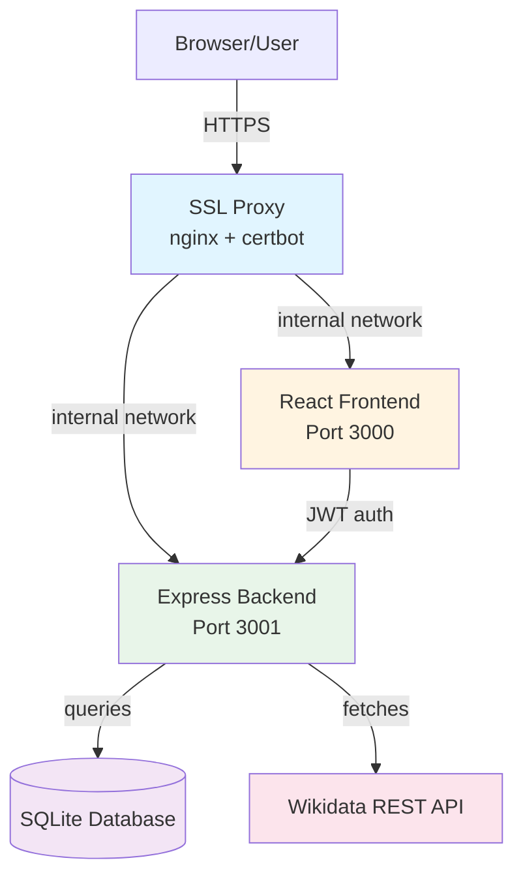

# Crudibase Wiki

Welcome to the **Crudibase** documentation wiki! Crudibase is a full-stack TypeScript application for exploring Wikibase knowledge graphs (like Wikidata) with an intuitive web interface.

## 🎯 Project Overview

**Status**: MVP Complete - Deployment Phase
**Stack**: React + Express + SQLite + TypeScript
**Testing**: Vitest + React Testing Library + Playwright
**Architecture**: Monorepo with npm workspaces

## 📚 Documentation Navigation

### Core Architecture
- **[[Architecture]]** - System architecture with block diagrams
- **[[Deployment-Architecture]]** - Production deployment setup
- **[[Database-Schema]]** - Database design and ER diagrams
- **[[Component-Hierarchy]]** - Frontend component organization

### Feature Flows
- **[[Authentication-Flow]]** - Registration and login sequences
- **[[Wikibase-Integration]]** - Search and entity retrieval flows
- **[[Collections-System]]** - Collection CRUD operations

### Reference
- **[[API-Reference]]** - REST API endpoints documentation
- **[[Development-Guide]]** - Setup and development workflow

## 🏗️ High-Level Architecture

## 🚀 Key Features

### ✅ Implemented (MVP)
- User registration and authentication (JWT)
- Wikibase entity search with live results
- Personal collections with CRUD operations
- Add entities to collections
- Responsive UI with Tailwind CSS
- SQLite database with caching

### 📋 Planned (Phase 2)
- Relationship graph visualization
- Timeline visualizations
- SPARQL query builder
- Public collections
- Google OAuth integration

## 📊 Current Status

| Component | Status | Coverage | Notes |
|-----------|--------|----------|-------|
| Backend | ✅ Complete | ~85% | All MVP endpoints working |
| Frontend | ✅ Complete | ~75% | Core UI implemented |
| Auth System | ✅ Complete | 100% | JWT + bcrypt |
| Wikibase Integration | ✅ Complete | ~80% | Search + caching |
| Collections | ✅ Complete | ~85% | Full CRUD |
| Deployment | 🚧 In Progress | N/A | SSL proxy configured |

## 🔑 Key Technologies

### Frontend
- **React 18** - UI framework
- **Vite** - Build tool
- **Tailwind CSS** - Styling
- **React Router v6** - Routing
- **Axios** - HTTP client

### Backend
- **Express.js** - Web framework
- **TypeScript** - Type safety
- **better-sqlite3** - Database
- **JWT** - Authentication
- **bcrypt** - Password hashing
- **Zod** - Validation

### Testing
- **Vitest** - Unit/integration tests
- **React Testing Library** - Component tests
- **Playwright** - E2E tests

### Deployment
- **Docker** - Containerization
- **nginx** - SSL proxy (from [ssl-proxy-for-do](https://github.com/softwarewrighter/ssl-proxy-for-do))
- **DigitalOcean** - Hosting + Container Registry

## 🧪 Development Approach

Crudibase is developed using **strict Test-Driven Development (TDD)** with:
- **RED-GREEN-REFACTOR** cycle
- Tests written before implementation
- >80% code coverage requirement
- Comprehensive E2E testing with Playwright

## 📖 Quick Links

- [GitHub Repository](https://github.com/softwarewrighter/crudibase)
- [SSL Proxy Repository](https://github.com/softwarewrighter/ssl-proxy-for-do)
- [Wikidata API Documentation](https://www.wikidata.org/wiki/Wikidata:REST_API)

## 🤝 Contributing

This is currently a solo learning project focused on best practices:
- TDD methodology
- Clean architecture
- Comprehensive documentation
- Production-ready deployment

## 📝 Documentation Status

Last Updated: 2025-11-17

All documentation is kept in sync with code changes. If you find discrepancies, please check the latest commit in the repository.

---

## Navigation

### Getting Started
1. Read the [[Architecture]] overview
2. Follow the [[Development-Guide]] to set up locally
3. Review [[API-Reference]] for backend endpoints

### Understanding Features
4. Study [[Authentication-Flow]] for auth implementation
5. Read [[Wikibase-Integration]] for search functionality
6. Explore [[Collections-System]] for CRUD operations

### Deployment
7. Review [[Deployment-Architecture]] for production setup
8. Check [[Database-Schema]] for data models

**Need help?** Check the issue tracker on GitHub.
