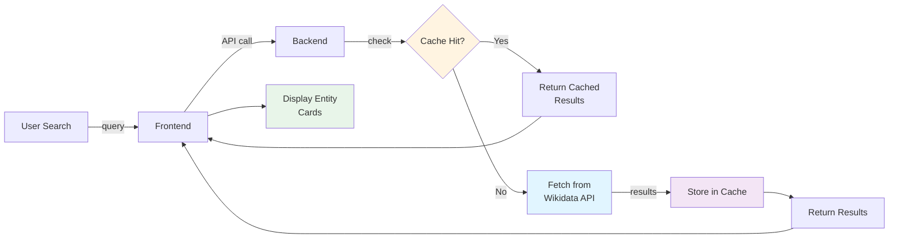
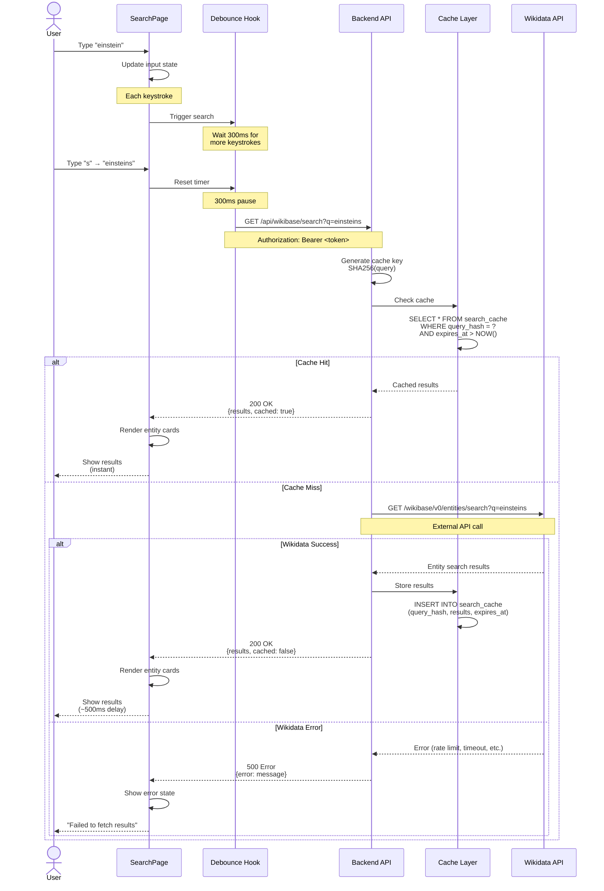
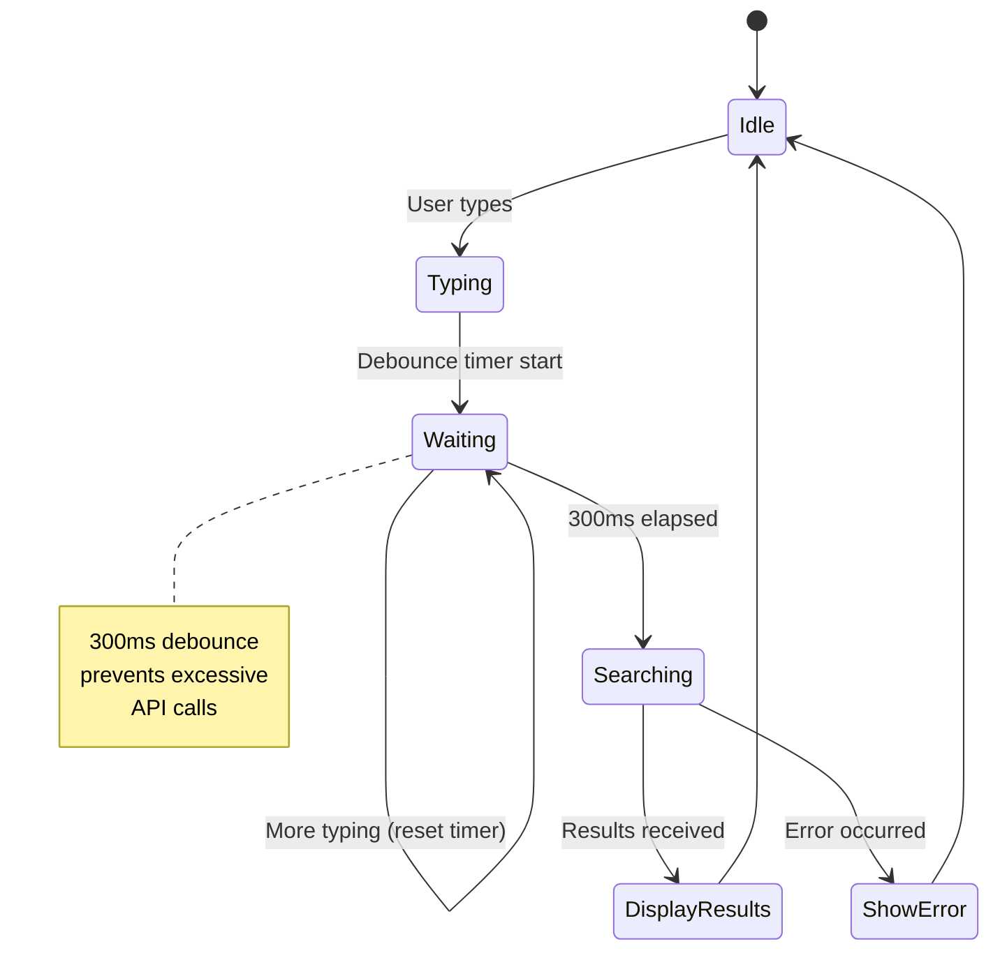
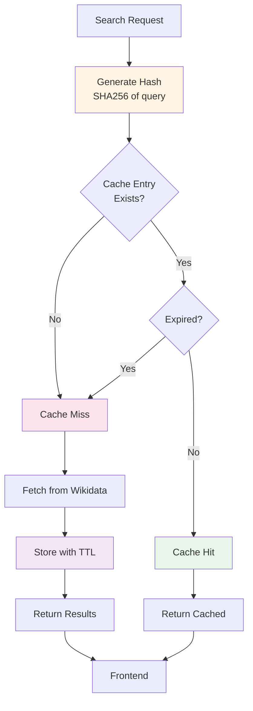
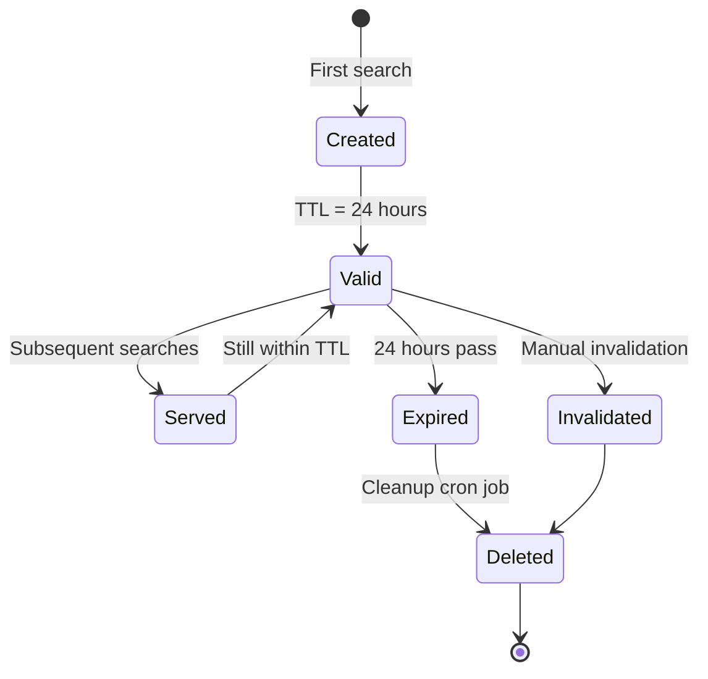
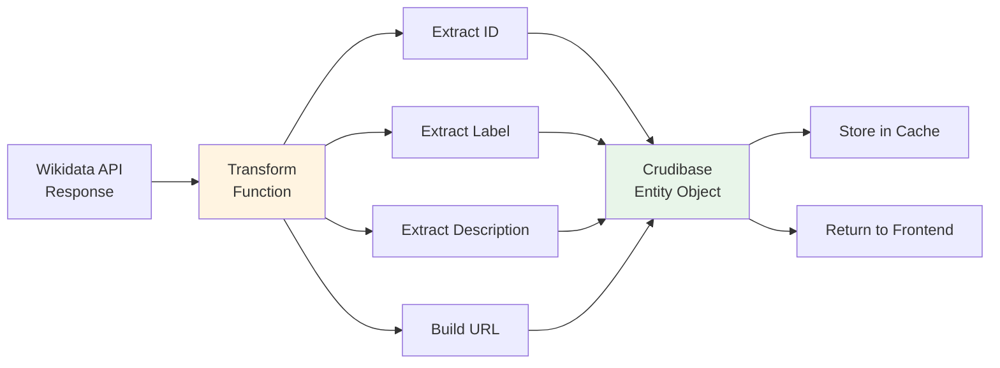
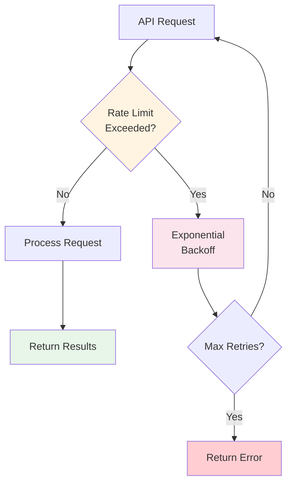
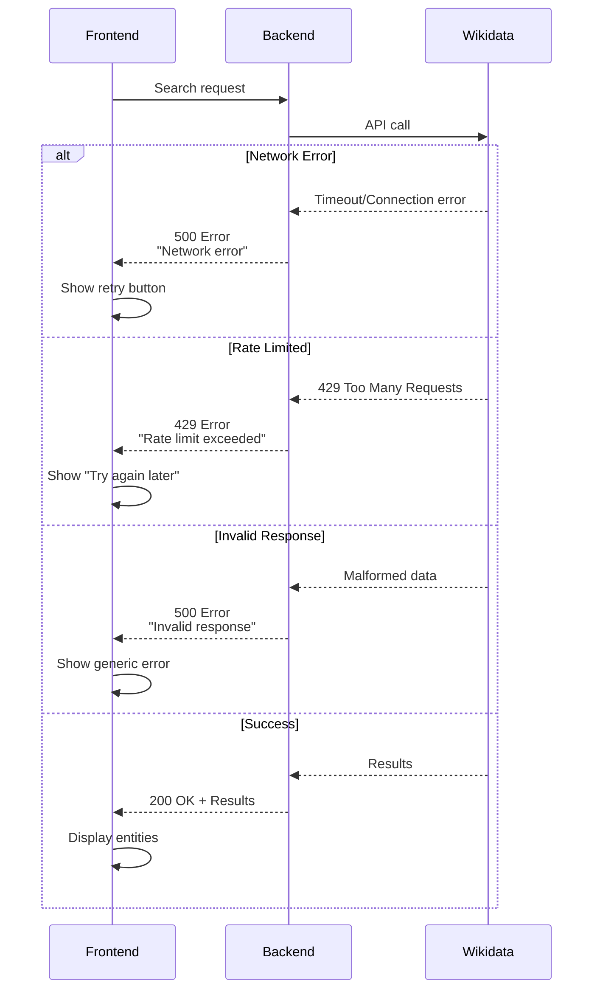
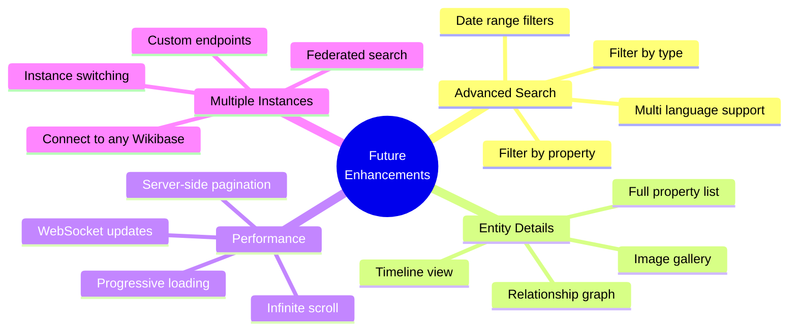

# Wikibase Integration

This page documents how Crudibase integrates with Wikidata and other Wikibase instances for entity search and data retrieval.

## Table of Contents
- [Overview](#overview)
- [Search Flow](#search-flow)
- [Caching Strategy](#caching-strategy)
- [Entity Data Structure](#entity-data-structure)
- [API Integration](#api-integration)
- [Error Handling](#error-handling)

## Overview

Crudibase integrates with the **Wikidata REST API** to provide entity search functionality with intelligent caching to reduce API load and improve performance.



**Key Features:**
- **Real-time search** against Wikidata
- **Intelligent caching** with configurable TTL
- **Debounced input** to reduce API calls
- **Error handling** with graceful degradation
- **Rate limiting awareness**

## Search Flow

### Complete Search Sequence



### Frontend Debouncing



**Implementation:**
```typescript
// Frontend debounce hook
const [searchQuery, setSearchQuery] = useState('');
const [debouncedQuery, setDebouncedQuery] = useState('');

useEffect(() => {
  const timer = setTimeout(() => {
    setDebouncedQuery(searchQuery);
  }, 300); // 300ms debounce

  return () => clearTimeout(timer);
}, [searchQuery]);

useEffect(() => {
  if (debouncedQuery) {
    performSearch(debouncedQuery);
  }
}, [debouncedQuery]);
```

## Caching Strategy

### Cache Architecture



### Cache Key Generation

```typescript
import crypto from 'crypto';

function generateCacheKey(query: string): string {
  return crypto
    .createHash('sha256')
    .update(query.toLowerCase().trim())
    .digest('hex');
}

// Example:
// "Einstein" → "8f14e45f..."
// "einstein" → "8f14e45f..." (same key, case-insensitive)
// "Einstein " → "8f14e45f..." (same key, trimmed)
```

### Cache Table Schema

```sql
CREATE TABLE search_cache (
  id INTEGER PRIMARY KEY AUTOINCREMENT,
  query_hash TEXT UNIQUE NOT NULL,
  query TEXT NOT NULL,
  results TEXT NOT NULL,  -- JSON string
  cached_at DATETIME DEFAULT CURRENT_TIMESTAMP,
  expires_at DATETIME NOT NULL
);

CREATE INDEX idx_search_cache_query_hash ON search_cache(query_hash);
CREATE INDEX idx_search_cache_expires_at ON search_cache(expires_at);
```

### Cache Lifecycle



**Cache Configuration:**
```typescript
const CACHE_CONFIG = {
  TTL_HOURS: 24,           // Cache expires after 24 hours
  MAX_ENTRIES: 10000,       // Max cache entries before cleanup
  CLEANUP_INTERVAL: '0 3 * * *'  // Daily at 3 AM
};
```

### Cache Cleanup

```typescript
// Periodic cleanup of expired entries
export async function cleanupExpiredCache() {
  const db = getDatabase();
  const result = db.prepare(`
    DELETE FROM search_cache
    WHERE expires_at < datetime('now')
  `).run();

  console.log(`Cleaned up ${result.changes} expired cache entries`);
}

// Also cleanup if cache grows too large
export async function cleanupOldestEntries(limit: number) {
  const db = getDatabase();
  db.prepare(`
    DELETE FROM search_cache
    WHERE id IN (
      SELECT id FROM search_cache
      ORDER BY cached_at ASC
      LIMIT ?
    )
  `).run(limit);
}
```

## Entity Data Structure

### Wikidata API Response

```json
{
  "id": "Q937",
  "key": "Q937",
  "label": "Albert Einstein",
  "description": "German-born theoretical physicist (1879-1955)",
  "match": {
    "type": "label",
    "language": "en",
    "text": "Albert Einstein"
  },
  "display": {
    "label": {
      "value": "Albert Einstein",
      "language": "en"
    },
    "description": {
      "value": "German-born theoretical physicist (1879-1955)",
      "language": "en"
    }
  }
}
```

### Crudibase Entity Format

```typescript
interface WikibaseEntity {
  id: string;              // Wikidata Q-ID (e.g., "Q937")
  label: string;           // Display name
  description: string;     // Brief description
  url?: string;            // Wikidata URL
  thumbnail?: string;      // Image URL (if available)
}

// Example:
{
  "id": "Q937",
  "label": "Albert Einstein",
  "description": "German-born theoretical physicist (1879-1955)",
  "url": "https://www.wikidata.org/wiki/Q937",
  "thumbnail": null
}
```

### Data Transformation



## API Integration

### Backend Service Implementation

```typescript
// src/backend/src/services/WikibaseService.ts

export class WikibaseService {
  private readonly BASE_URL = 'https://www.wikidata.org/w/rest.php/wikibase/v0';

  async search(query: string, limit: number = 10): Promise<SearchResult> {
    // Generate cache key
    const cacheKey = this.generateCacheKey(query);

    // Check cache
    const cached = await this.getFromCache(cacheKey);
    if (cached) {
      return { results: cached, cached: true };
    }

    // Fetch from Wikidata
    const url = `${this.BASE_URL}/entities/search`;
    const params = new URLSearchParams({
      q: query,
      limit: limit.toString(),
      language: 'en'
    });

    try {
      const response = await axios.get(`${url}?${params}`);
      const entities = this.transformResults(response.data);

      // Store in cache
      await this.storeInCache(cacheKey, query, entities);

      return { results: entities, cached: false };
    } catch (error) {
      throw new Error(`Wikidata API error: ${error.message}`);
    }
  }

  private transformResults(data: any[]): WikibaseEntity[] {
    return data.map(item => ({
      id: item.id,
      label: item.display?.label?.value || item.label || '',
      description: item.display?.description?.value || item.description || '',
      url: `https://www.wikidata.org/wiki/${item.id}`
    }));
  }
}
```

### API Endpoint

**GET `/api/wikibase/search`**

**Query Parameters:**
```typescript
{
  q: string;      // Search query (required)
  limit?: number; // Max results (default: 10, max: 50)
}
```

**Request Example:**
```http
GET /api/wikibase/search?q=einstein&limit=10
Authorization: Bearer <token>
```

**Success Response (200):**
```json
{
  "query": "einstein",
  "results": [
    {
      "id": "Q937",
      "label": "Albert Einstein",
      "description": "German-born theoretical physicist",
      "url": "https://www.wikidata.org/wiki/Q937"
    }
  ],
  "total": 147,
  "cached": false
}
```

### Rate Limiting Awareness



**Wikidata Rate Limits:**
- **Anonymous**: ~200 requests/minute
- **Authenticated**: Higher limits (token-based)

**Mitigation Strategies:**
1. **Caching** - Primary strategy (24-hour TTL)
2. **Debouncing** - Reduce search frequency
3. **Exponential Backoff** - Retry on rate limit errors
4. **User Feedback** - Show "too many requests" message

## Error Handling

### Error Flow



### Error States in Frontend

```typescript
interface SearchState {
  query: string;
  results: WikibaseEntity[];
  loading: boolean;
  error: string | null;
  cached: boolean;
}

// Error handling
try {
  const response = await axios.get('/api/wikibase/search', { params: { q: query } });
  setState({
    results: response.data.results,
    loading: false,
    error: null,
    cached: response.data.cached
  });
} catch (error) {
  if (error.response?.status === 429) {
    setState({
      error: 'Too many requests. Please try again in a moment.',
      loading: false
    });
  } else {
    setState({
      error: 'Failed to search. Please try again.',
      loading: false
    });
  }
}
```

## Future Enhancements

### Planned Features



### Phase 2 Features

1. **Relationship Graph** - Visualize entity connections
2. **Timeline View** - Chronological entity data
3. **Property Explorer** - Detailed property inspection
4. **SPARQL Integration** - Advanced query support

## Related Pages

- [[Architecture]] - Overall system architecture
- [[Collections-System]] - How entities are saved to collections
- [[API-Reference]] - Complete API documentation
- [[Database-Schema]] - Cache table schema details

---

**Last Updated**: 2025-11-17
